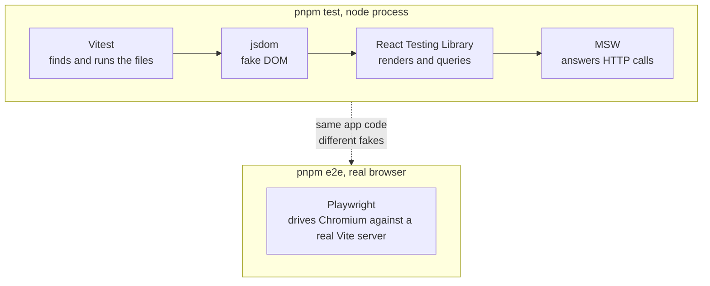

# Client testing

Four tools, one job each. Nothing here overlaps, which is why all four exist.

## Which tool does what



| | Vitest | React Testing Library | MSW | Playwright |
| --- | --- | --- | --- | --- |
| Job | runs the tests | renders and queries components | answers network calls | drives a real browser |
| Runs in | Node with jsdom | Node with jsdom | Node with jsdom | Chromium |
| Fakes | nothing | nothing | the HTTP layer | the API, through `page.route` |
| Speed | milliseconds | milliseconds | milliseconds | seconds |
| Command | `pnpm test` | `pnpm test` | `pnpm test` | `pnpm e2e` |
| Config | `test` block in [vite.config.ts](../../vite.config.ts) | [src/test/test-utils.tsx](../../src/test/test-utils.tsx) | [src/test/msw/handlers.ts](../../src/test/msw/handlers.ts) | [playwright.config.ts](../../playwright.config.ts) |
| Doc | [1](./Vitest.doc.md) | [2](./React_Testing_library.doc.md) | [3](./MSW.doc.md) | [4](./Playwright.doc.md) |

The first three are one stack, not three choices. A single component test uses
all three at once: Vitest runs the file, RTL renders the component, MSW answers
the request the component fires.

## Read in this order

| # | Doc | Why here |
| --- | --- | --- |
| 1 | [Vitest](./Vitest.doc.md) | the runner boots everything else |
| 2 | [React Testing Library](./React_Testing_library.doc.md) | how a component gets on the fake DOM |
| 3 | [MSW](./MSW.doc.md) | what answers the component's API calls |
| 4 | [Playwright](./Playwright.doc.md) | the same flows against a real browser |

## What is tested today

| Kind | Count | Files |
| --- | --- | --- |
| Unit | 6 | `constants`, `api/client`, `utils/rolePermissions`, `utils/format`, `validation/schemas`, `layout/navVisibility` |
| Component | 6 | `AuthPage`, `PostsPage`, `ProtectedRoute`, `FormFields`, `Dialogs`, `AppShell` |
| End-to-end | 2 | [e2e/auth.spec.ts](../../e2e/auth.spec.ts), [e2e/rbac.spec.ts](../../e2e/rbac.spec.ts) |

## Commands

```bash
pnpm test           # watch mode
pnpm test:run       # single run
pnpm test:coverage  # single run plus a V8 coverage report
pnpm e2e            # Playwright, boots its own dev server on 5174
pnpm e2e:headed     # same, with the browser window visible
```

## Choosing where a test belongs

| The thing you want to prove | Write it as |
| --- | --- |
| A pure function returns the right value | unit test, no render |
| A component shows the right thing for a given prop or role | component test with `renderWithProviders` |
| A component reacts correctly to an API failure | component test plus `server.use(...)` for that one case |
| A whole login or permission flow works across pages | Playwright spec |

Reach for Playwright last. It catches wiring that the jsdom stack cannot see,
such as cookies, redirects and real navigation, and it costs seconds per test
instead of milliseconds.

---

Previous: [client/docs index](../docs.index.md).
Next: [Vitest](./Vitest.doc.md), the runner everything else boots from.
