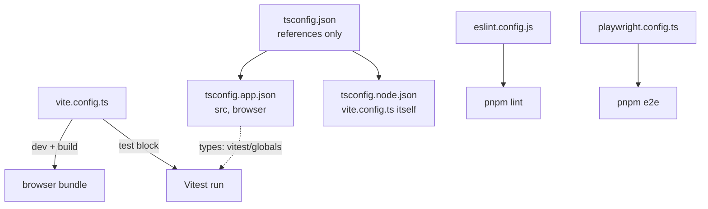

# Frontend configuration

Five config files decide how this client builds, type-checks, tests and lints.
This walks each one and says which knob does what.

## The map



| File | Owns | Read by |
| --- | --- | --- |
| [vite.config.ts](../vite.config.ts) | plugins, alias, dev proxy, the whole Vitest block | `vite`, `vitest` |
| [tsconfig.json](../tsconfig.json) | nothing but references to the other two | `tsc -b` |
| [tsconfig.app.json](../tsconfig.app.json) | type rules for `src/`, browser target | `tsc -b`, the editor |
| [tsconfig.node.json](../tsconfig.node.json) | type rules for config files running in Node | `tsc -b` |
| [eslint.config.js](../eslint.config.js) | lint rules, flat config format | `pnpm lint` |
| [playwright.config.ts](../playwright.config.ts) | browser test run and its dev server | `pnpm e2e` |

## vite.config.ts

One file covers dev server, production build and the test runner, because
`defineConfig` is imported from `vitest/config` rather than `vite`.

### Plugins

| Plugin | Gives you |
| --- | --- |
| `react()` | JSX compilation and Fast Refresh |
| `tailwindcss()` | the Tailwind v4 compiler inside Vite's pipeline, no PostCSS step |

### Alias

```ts
resolve: { alias: { '@': path.resolve(__dirname, 'src') } }
```

`@/components/Button` instead of `../../components/Button`. This has a twin:
`paths` in `tsconfig.app.json`. Vite resolves the import at build time,
TypeScript resolves it for the editor. Change one and you must change the other,
or the build works while the editor shows a missing module.

### Dev proxy

```ts
server: { proxy: { '/api': { target: 'http://localhost:8000', changeOrigin: true } } }
```

In dev, `/api/auth/login` is forwarded to `http://localhost:8000/api/auth/login`.
The browser only ever talks to the Vite origin, so there is no CORS
preflight and the backend needs no dev-only CORS rule.

### The test block

| Option | Value | Effect |
| --- | --- | --- |
| `globals` | `true` | `describe`, `it`, `expect`, `vi` exist without imports |
| `environment` | `'jsdom'` | each worker gets `window`, `document`, `localStorage` |
| `setupFiles` | `['./src/test/setup.ts']` | runs once per worker before any test |
| `css` | `true` | CSS imports are processed, not stubbed, so Tailwind classes land |
| `include` | `['src/**/*.test.{ts,tsx}']` | `e2e/*.spec.ts` is deliberately outside this |
| `coverage.provider` | `'v8'` | native coverage, no Istanbul instrumentation |
| `coverage.reporter` | `text`, `html`, `lcov` | terminal, browsable, machine-readable |
| `coverage.exclude` | `src/test/**`, `src/api/schema.ts`, `src/main.tsx`, `*.d.ts` | test scaffolding, generated types and the entry point are not code under test |

Full walkthrough: [Client testing](./Client%20Tests/README.md).

## The three tsconfig files

`tsconfig.json` compiles nothing. It is a project-reference root with
`"files": []`, pointing at two real configs so browser code and Node config code
never share a `lib`.

| | tsconfig.app.json | tsconfig.node.json |
| --- | --- | --- |
| Covers | `src` | `vite.config.ts` |
| `lib` | `ES2023`, `DOM` | `ES2023` |
| `types` | `vite/client`, `vitest/globals` | `node` |
| `jsx` | `react-jsx` | none |
| `paths` | `@/*` to `./src/*` | none |

Both share the strict settings that matter: `noUnusedLocals`,
`noUnusedParameters`, `noFallthroughCasesInSwitch`, `erasableSyntaxOnly`,
`verbatimModuleSyntax`, `moduleResolution: "bundler"` and `noEmit: true`. Vite
does the emitting; `tsc -b` only checks.

`"types": ["vitest/globals"]` in the app config is what makes `globals: true`
type-check. Remove it and every test file turns red in the editor while still
passing on the command line.

## eslint.config.js

Flat config, four rule sets layered in order:

1. `js.configs.recommended`
2. `tseslint.configs.recommended`
3. `reactHooks.configs.flat.recommended`
4. `reactRefresh.configs.vite`

Scoped to `**/*.{ts,tsx}` with `globals.browser`, and `dist` is ignored globally.

## playwright.config.ts

| Setting | Value | Why it matters |
| --- | --- | --- |
| `testDir` | `./e2e` | outside the Vitest glob, so the two runners never collide |
| `timeout` | 30s per test | a real browser is slower than jsdom |
| `fullyParallel` | `true` | specs run concurrently |
| `retries` | `1` | one retry, and the retry is the run that records a trace |
| `baseURL` | `http://localhost:5174` | lets specs write `page.goto('/login')` |
| `trace` | `'on-first-retry'` | full timeline for the flaky run only |
| `screenshot` | `'only-on-failure'` | lands in `test-results/` |
| `webServer.command` | `pnpm exec vite --port 5174 --strictPort` | Playwright starts the app itself |
| `webServer.reuseExistingServer` | `true` | reuses a dev server already on 5174 |

Port 5174 is not the normal dev port, so an e2e run and a `pnpm dev` session can
coexist. `--strictPort` makes a clash fail loudly instead of quietly serving
tests from the wrong port.

## Where this shows up

**The editor cannot find `@/something` but the build works.** The alias exists in
`vite.config.ts` and is missing from `paths` in `tsconfig.app.json`, or the other
way round. They are two separate declarations of the same rule.

**Requests 404 in dev but work in production.** The path did not start with
`/api`, so the proxy never matched it and the browser asked the Vite server for
an endpoint it does not have.

**Coverage looks worse after adding types.** `src/api/schema.ts` is generated by
`pnpm generate:types` and excluded on purpose. Any newly generated file needs the
same treatment or it dilutes the number.

**`pnpm e2e` fails at startup.** Something else holds port 5174. That is
`--strictPort` working as intended.

---

Previous: [client/docs index](./docs.index.md).
Next: [Client testing](./Client%20Tests/README.md), the `test` block above in practice.
