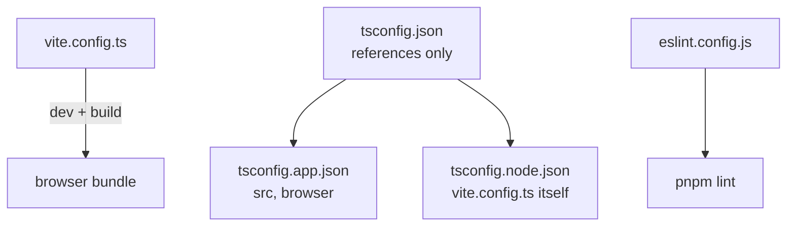

# Frontend configuration

Five config files decide how this client builds, type-checks and lints.
This walks each one and says which knob does what.

## The map



| File | Owns | Read by |
| --- | --- | --- |
| [vite.config.ts](../vite.config.ts) | plugins, alias, dev proxy | `vite` |
| [tsconfig.json](../tsconfig.json) | nothing but references to the other two | `tsc -b` |
| [tsconfig.app.json](../tsconfig.app.json) | type rules for `src/`, browser target | `tsc -b`, the editor |
| [tsconfig.node.json](../tsconfig.node.json) | type rules for config files running in Node | `tsc -b` |
| [eslint.config.js](../eslint.config.js) | lint rules, flat config format | `pnpm lint` |

## vite.config.ts

One file covers the dev server and the production build.

### Plugins

| Plugin | Gives you |
| --- | --- |
| `react()` | JSX compilation and Fast Refresh |
| `tailwindcss()` | the Tailwind v4 compiler inside Vite's pipeline, no PostCSS step |

### Alias

```ts
resolve: { alias: { '@': path.resolve(__dirname, 'src') } }
```

`@/components/Button` instead of `../../components/Button`. This has a twin:
`paths` in `tsconfig.app.json`. Vite resolves the import at build time,
TypeScript resolves it for the editor. Change one and you must change the other,
or the build works while the editor shows a missing module.

### Dev proxy

```ts
server: { proxy: { '/api': { target: 'http://localhost:8000', changeOrigin: true } } }
```

In dev, `/api/auth/login` is forwarded to `http://localhost:8000/api/auth/login`.
The browser only ever talks to the Vite origin, so there is no CORS
preflight and the backend needs no dev-only CORS rule.

## The three tsconfig files

`tsconfig.json` compiles nothing. It is a project-reference root with
`"files": []`, pointing at two real configs so browser code and Node config code
never share a `lib`.

| | tsconfig.app.json | tsconfig.node.json |
| --- | --- | --- |
| Covers | `src` | `vite.config.ts` |
| `lib` | `ES2023`, `DOM` | `ES2023` |
| `types` | `vite/client` | `node` |
| `jsx` | `react-jsx` | none |
| `paths` | `@/*` to `./src/*` | none |

Both share the strict settings that matter: `noUnusedLocals`,
`noUnusedParameters`, `noFallthroughCasesInSwitch`, `erasableSyntaxOnly`,
`verbatimModuleSyntax`, `moduleResolution: "bundler"` and `noEmit: true`. Vite
does the emitting; `tsc -b` only checks.

## eslint.config.js

Flat config, four rule sets layered in order:

1. `js.configs.recommended`
2. `tseslint.configs.recommended`
3. `reactHooks.configs.flat.recommended`
4. `reactRefresh.configs.vite`

Scoped to `**/*.{ts,tsx}` with `globals.browser`, and `dist` is ignored globally.

## Where this shows up

**The editor cannot find `@/something` but the build works.** The alias exists in
`vite.config.ts` and is missing from `paths` in `tsconfig.app.json`, or the other
way round. They are two separate declarations of the same rule.

**Requests 404 in dev but work in production.** The path did not start with
`/api`, so the proxy never matched it and the browser asked the Vite server for
an endpoint it does not have.

---

Previous: [client/docs index](./docs.index.md).
Next: [OpenAPI spec and Swagger UI](./OpenAPI_spec_3.1.doc.md), still a placeholder.
