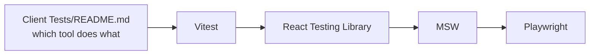

# Client documentation

Learning docs for the React client. Each one explains a topic as it is actually
wired in this repo, not in general.

## Topics

| # | Topic | Doc | Status |
| --- | --- | --- | --- |
| 1 | Configuration | [Configurations.doc.md](./Configurations.doc.md) | written |
| 2 | Testing, 5 docs | [Client Tests/](./Client%20Tests/README.md) | written |
| 3 | OpenAPI spec and Swagger UI | [OpenAPI_spec_3.1.doc.md](./OpenAPI_spec_3.1.doc.md) | empty |
| 4 | Authentication | [Authentication.doc.md](./Authentication.doc.md) | empty |
| 5 | State management | [State Management.doc.md](./State%20Management.doc.md) | empty |
| 6 | React | [React.doc.md](./React.doc.md) | empty |
| 7 | Separation of concerns | [Seperation_of_concern.doc.md](./Seperation_of_concern.doc.md) | empty |
| 8 | Conditional rendering | [Conditional_Rendering.doc.md](./Conditional_Rendering.doc.md) | empty |

Six files are placeholders. They are listed so the shape of the set is visible,
and so nobody writes a second copy of a topic that already has a home.

## Testing, in five parts

| Doc | Covers |
| --- | --- |
| [Client testing index](./Client%20Tests/README.md) | which of the four tools to reach for, and what is tested today |
| [Vitest](./Client%20Tests/Vitest.doc.md) | the runner, config resolution, the setup file, coverage |
| [React Testing Library](./Client%20Tests/React_Testing_library.doc.md) | `renderWithProviders`, queries, `userEvent`, cleanup |
| [MSW](./Client%20Tests/MSW.doc.md) | handlers, the fake API envelope, per-test overrides, fixtures |
| [Playwright](./Client%20Tests/Playwright.doc.md) | real browser specs, route mocking, the auto-started dev server |

## Related

- [client/README.md](../README.md), quick start and scripts.
- [client/plan_readme/](../plan_readme), design history and planning notes. Not maintained as reference.
- [server/docs/](../../server/docs/README.md), the API this client talks to.
- [report/](../../report/index.md), the audit covering both sides.

---

Previous: [client/README.md](../README.md).
Next: [Configuration](./Configurations.doc.md), what every config file in the client does.
