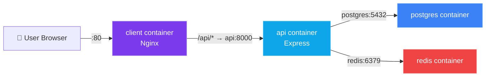
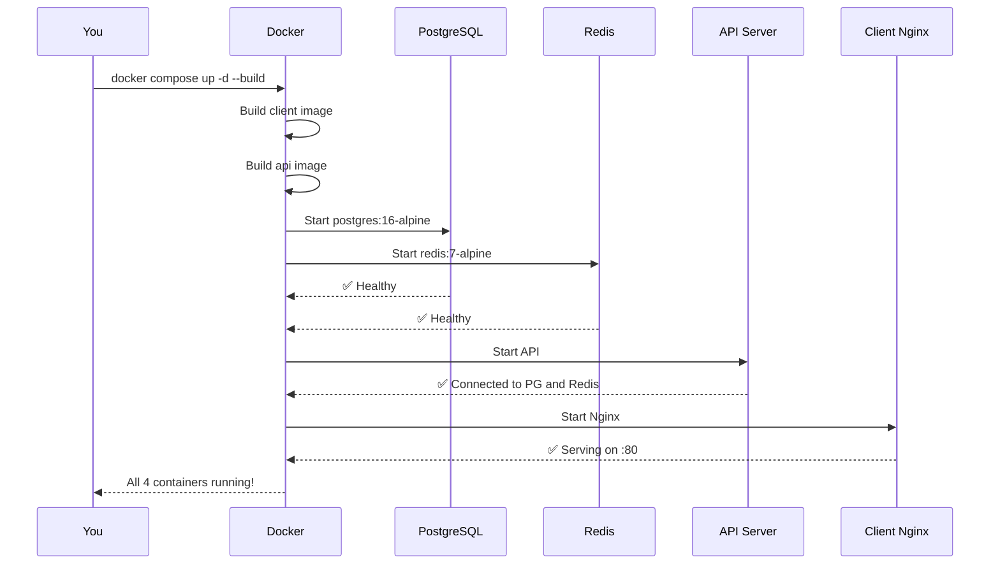

# 🐳 Docker Implementation Guide — RoleControl IAM

> A beginner-friendly, step-by-step guide to containerizing your full-stack RBAC application.

---

## Table of Contents

1. [What is Docker and Why Do You Need It?](#1-what-is-docker-and-why-do-you-need-it)
2. [Your Application Architecture](#2-your-application-architecture)
3. [What Needs to Be Containerized](#3-what-needs-to-be-containerized)
4. [Step 1 — Dockerize the React Client](#4-step-1--dockerize-the-react-client)
5. [Step 2 — Dockerize the Express API Server](#5-step-2--dockerize-the-express-api-server)
6. [Step 3 — Configure PostgreSQL & Redis](#6-step-3--configure-postgresql--redis)
7. [Step 4 — Docker Compose (Orchestrate Everything)](#7-step-4--docker-compose-orchestrate-everything)
8. [Step 5 — Environment Configuration](#8-step-5--environment-configuration)
9. [Step 6 — .dockerignore Files](#9-step-6--dockerignore-files)
10. [Step 7 — Running It All](#10-step-7--running-it-all)
11. [Step 8 — Pre-Deployment Checklist](#11-step-8--pre-deployment-checklist)
12. [What Deployment Looks Like (Brief)](#12-what-deployment-looks-like-brief)

---

## 1. What is Docker and Why Do You Need It?

**Docker packages your app + its environment into a portable box called a "container".**

Think of it this way — right now, to run your project, someone needs to:

- Install the right Node.js version
- Install and configure PostgreSQL locally
- Install and run Redis
- Set up the right `.env` values
- Run `pnpm install` in both `client/` and `server/`
- Hope nothing conflicts with their OS

**Docker eliminates ALL of that.** One command (`docker compose up`) and everything runs identically on any machine.

```mermaid
graph LR
    subgraph WITHOUT["❌ Without Docker"]
        A["Your Laptop"] -->|works| B["Your App"]
        C["Friend's Laptop"] -->|BREAKS| D["Your App"]
        E["Production Server"] -->|BREAKS DIFFERENTLY| F["Your App"]
    end

    subgraph WITH["✅ With Docker"]
        G["Any Machine"] -->|docker compose up| H["Container"]
        H --> I["Always Works Identically"]
    end

    style WITHOUT fill:#2d1b1b,stroke:#ef4444
    style WITH fill:#1b2d1b,stroke:#10b981
```



> [!TIP]
> **The core promise of Docker:** "If it works in a container on your machine, it works in a container EVERYWHERE."

---

## 2. Your Application Architecture

Based on analyzing your codebase, here's what your app looks like today:

```mermaid
graph TB
    Browser["🌐 Browser"]

    subgraph CLIENT["client/ — React + Vite + TailwindCSS"]
        Vite["Vite Dev Server :5173"]
        React["React 19 SPA"]
        Axios["Axios API Client"]
    end

    subgraph SERVER["server/ — Express 5 API"]
        Express["Express :8000"]
        Auth["JWT Auth + bcrypt"]
        RBAC["RBAC Middleware"]
        Migrate["node-pg-migrate"]
    end

    subgraph DATA["Data Layer"]
        PG["PostgreSQL :5432"]
        Redis["Redis :6379"]
    end

    Browser --> Vite
    Vite -->|"proxy /api → :8000"| Express
    Express --> PG
    Express --> Redis

    style CLIENT fill:#1e1b4b,stroke:#7c3aed
    style SERVER fill:#0c4a6e,stroke:#0ea5e9
    style DATA fill:#14532d,stroke:#22c55e
```



**Key files discovered:**

| Component      | Key Config                                           | Port       |
| -------------- | ---------------------------------------------------- | ---------- |
| **Client**     | `vite.config.ts` — proxies `/api` → `localhost:8000` | 5173 (dev) |
| **Server**     | `index.ts` — Express on `env.PORT` (8000)            | 8000       |
| **PostgreSQL** | `db.connect.ts` — uses `env.DB_*` vars               | 5432       |
| **Redis**      | `redis.connect.ts` — uses `env.REDIS_*` vars         | 6379       |
| **Migrations** | `db.migrate.ts` + `migrations/*.sql`                 | —          |

---

## 3. What Needs to Be Containerized

You need **4 containers**, each responsible for one concern:

```mermaid
graph TB
    subgraph COMPOSE["docker-compose.yml"]
        direction TB

        C1["📦 Container 1: client<br/>Nginx serving React build<br/>Port 80"]
        C2["📦 Container 2: api<br/>Node.js Express server<br/>Port 8000"]
        C3["📦 Container 3: postgres<br/>PostgreSQL 16 database<br/>Port 5432"]
        C4["📦 Container 4: redis<br/>Redis 7 cache<br/>Port 6379"]

        V1[("💾 Volume: pgdata<br/>DB survives restarts")]
        V2[("💾 Volume: redis-data<br/>Cache survives restarts")]

        C1 -->|"/api/* requests"| C2
        C2 --> C3
        C2 --> C4
        C3 --- V1
        C4 --- V2
    end

    style COMPOSE fill:#0f172a,stroke:#38bdf8
    style C1 fill:#7c3aed,stroke:#a78bfa,color:#fff
    style C2 fill:#0ea5e9,stroke:#38bdf8,color:#fff
    style C3 fill:#3b82f6,stroke:#60a5fa,color:#fff
    style C4 fill:#ef4444,stroke:#f87171,color:#fff
```



> [!IMPORTANT]
> **PostgreSQL and Redis already exist as services on your machine.** Docker replaces your local installs with containers — same software, but isolated and reproducible.

---

## 4. Step 1 — Dockerize the React Client

### What you're doing

Building your React app into static HTML/CSS/JS files, then serving them with Nginx (a fast, production-grade web server).

### What to expect

After this step, your entire frontend becomes a tiny (~25MB) container that serves your app blazingly fast — no Node.js needed at runtime.

### The Dockerfile: `client/Dockerfile`

```dockerfile
# ============================================
# STAGE 1: Build the React application
# ============================================
# We start from a Node.js image to run "pnpm build"
FROM node:22-alpine AS builder

# Enable pnpm (your project's package manager)
RUN corepack enable && corepack prepare pnpm@latest --activate

# Set the working directory inside the container
WORKDIR /app

# Copy ONLY dependency files first (this is a caching trick!)
# Docker caches each layer. If package.json hasn't changed,
# Docker skips "pnpm install" on rebuilds — saving minutes.
COPY package.json pnpm-lock.yaml ./

# Install dependencies
RUN pnpm install --frozen-lockfile

# Now copy all source code
COPY . .

# Build the production bundle (runs: tsc -b && vite build)
# This creates a "dist/" folder with static files
RUN pnpm build

# ============================================
# STAGE 2: Serve with Nginx
# ============================================
# Start fresh from a tiny Nginx image (no Node.js bloat!)
FROM nginx:alpine

# Copy our built files into Nginx's serving directory
COPY --from=builder /app/dist /usr/share/nginx/html

# Copy custom Nginx config (we'll create this next)
COPY nginx.conf /etc/nginx/conf.d/default.conf

# Expose port 80
EXPOSE 80

# Start Nginx in the foreground
CMD ["nginx", "-g", "daemon off;"]
```

### Why two stages?

```mermaid
graph LR
    subgraph S1["Stage 1: builder ~1.2 GB"]
        N["Node.js 22"] --> PM["pnpm install"] --> BUILD["vite build"] --> DIST["dist/ folder"]
    end

    subgraph S2["Stage 2: final ~25 MB"]
        NGX["Nginx Alpine"] --> COPY["Copy dist/"] --> SERVE["Serve static files"]
    end

    DIST -->|"COPY --from=builder"| COPY
    S1 -.->|"discarded!"| X["🗑️"]

    style S1 fill:#1e1b4b,stroke:#7c3aed
    style S2 fill:#14532d,stroke:#22c55e
    style X fill:#7f1d1d,stroke:#ef4444
```



> [!NOTE]
> **Multi-stage builds** mean your final image is TINY. Stage 1 (with Node.js, pnpm, all dev deps) is thrown away. Only the built files survive into Stage 2.

### The Nginx config: `client/nginx.conf`

```nginx
server {
    listen 80;
    server_name localhost;
    root /usr/share/nginx/html;
    index index.html;

    # Serve static files with caching
    location /assets/ {
        expires 1y;
        add_header Cache-Control "public, immutable";
    }

    # Proxy API requests to the backend container
    # "api" is the container name defined in docker-compose.yml
    location /api/ {
        proxy_pass http://api:8000;
        proxy_set_header Host $host;
        proxy_set_header X-Real-IP $remote_addr;
        proxy_set_header X-Forwarded-For $proxy_add_x_forwarded_for;
        proxy_set_header X-Forwarded-Proto $scheme;
    }

    # SPA fallback: any route that isn't a file → serve index.html
    # This is critical for React Router to work!
    location / {
        try_files $uri $uri/ /index.html;
    }
}
```

> [!IMPORTANT]
> **Why `proxy_pass http://api:8000`?** In Docker Compose, containers talk to each other by **service name**. Your backend service is named `api`, so Nginx reaches it at `http://api:8000` — no `localhost` needed.

---

## 5. Step 2 — Dockerize the Express API Server

### What you're doing

Packaging your Node.js server so it runs identically everywhere, with all its dependencies baked in.

### What to expect

A container that starts your Express API on port 8000, ready to talk to PostgreSQL and Redis containers.

### The Dockerfile: `server/Dockerfile`

```dockerfile
# ============================================
# STAGE 1: Install dependencies
# ============================================
FROM node:22-alpine AS deps

RUN corepack enable && corepack prepare pnpm@latest --activate
WORKDIR /app

COPY package.json pnpm-lock.yaml ./
RUN pnpm install --frozen-lockfile

# ============================================
# STAGE 2: Production image
# ============================================
FROM node:22-alpine

RUN corepack enable && corepack prepare pnpm@latest --activate
WORKDIR /app

# Copy dependencies from Stage 1
COPY --from=deps /app/node_modules ./node_modules
COPY --from=deps /app/package.json ./

# Copy source code and migrations
COPY . .

# Your server runs on port 8000
EXPOSE 8000

# Health check — Docker will monitor if your server is alive
HEALTHCHECK --interval=30s --timeout=5s --retries=3 \
    CMD wget --no-verbose --tries=1 --spider http://localhost:8000/ || exit 1

# Start the server using tsx (for TypeScript execution)
# In production, you'd use: node dist/index.js after "pnpm build"
CMD ["pnpm", "dev"]
```

> [!TIP]
> **For production**, you'd change the last line to:
>
> ```dockerfile
> RUN pnpm build
> CMD ["node", "dist/index.js"]
> ```
>
> But for learning/development, `pnpm dev` (tsx watch) is fine — it gives you hot-reload inside the container.

---

## 6. Step 3 — Configure PostgreSQL & Redis

### What you're doing

These are **pre-built images** — you don't write Dockerfiles for them. You just configure them in `docker-compose.yml`.

### What to expect

PostgreSQL and Redis will start automatically with your specified passwords and ports. Your data will persist across restarts via Docker volumes.

```mermaid
graph TB
    subgraph PG["PostgreSQL Container"]
        IMG1["Image: postgres:16-alpine"]
        ENV1["POSTGRES_USER=postgres<br/>POSTGRES_PASSWORD=postgres<br/>POSTGRES_DB=postgres"]
        VOL1[("Volume: pgdata → /var/lib/postgresql/data")]
    end

    subgraph RD["Redis Container"]
        IMG2["Image: redis:7-alpine"]
        VOL2[("Volume: redis-data → /data")]
    end

    style PG fill:#1e3a5f,stroke:#3b82f6
    style RD fill:#5f1e1e,stroke:#ef4444
```



> [!CAUTION]
> **Volumes are critical.** Without volumes, your database is wiped clean every time the container restarts. The volume maps a directory on your host machine to the container's data directory.

---

## 7. Step 4 — Docker Compose (Orchestrate Everything)

### What you're doing

Writing ONE file that defines all 4 containers, their connections, and their configuration.

### What to expect

Running `docker compose up` will start your entire stack — database, cache, API, and frontend — with one command.

### The file: `docker-compose.yml` (project root)

```yaml
# Docker Compose file for RoleControl IAM
# Usage: docker compose up -d

services:
  # ─── PostgreSQL Database ─────────────────────────
  postgres:
    image: postgres:16-alpine
    container_name: rbac-postgres
    restart: unless-stopped
    environment:
      POSTGRES_USER: ${DB_USER:-postgres}
      POSTGRES_PASSWORD: ${DB_PASSWORD:-postgres}
      POSTGRES_DB: ${DB_NAME:-postgres}
    ports:
      - "${DB_PORT:-5432}:5432"
    volumes:
      - pgdata:/var/lib/postgresql/data
    healthcheck:
      test: ["CMD-SHELL", "pg_isready -U ${DB_USER:-postgres}"]
      interval: 10s
      timeout: 5s
      retries: 5

  # ─── Redis Cache ─────────────────────────────────
  redis:
    image: redis:7-alpine
    container_name: rbac-redis
    restart: unless-stopped
    ports:
      - "${REDIS_PORT:-6379}:6379"
    volumes:
      - redis-data:/data
    healthcheck:
      test: ["CMD", "redis-cli", "ping"]
      interval: 10s
      timeout: 5s
      retries: 5

  # ─── Express API Server ──────────────────────────
  api:
    build:
      context: ./server
      dockerfile: Dockerfile
    container_name: rbac-api
    restart: unless-stopped
    ports:
      - "${PORT:-8000}:8000"
    env_file:
      - ./server/.env.docker
    depends_on:
      postgres:
        condition: service_healthy
      redis:
        condition: service_healthy

  # ─── React Frontend (Nginx) ─────────────────────
  client:
    build:
      context: ./client
      dockerfile: Dockerfile
    container_name: rbac-client
    restart: unless-stopped
    ports:
      - "80:80"
    depends_on:
      - api

# ─── Persistent Volumes ───────────────────────────
volumes:
  pgdata:
    driver: local
  redis-data:
    driver: local
```

### How containers communicate



> [!NOTE]
> **`depends_on` with `condition: service_healthy`** means Docker waits until PostgreSQL passes its health check (`pg_isready`) before starting the API. This prevents the "database connection refused" error you'd get if the API started before the DB was ready.

---

## 8. Step 5 — Environment Configuration

### What you're doing

Creating a Docker-specific `.env` file where `localhost` is replaced with container names.

### What to expect

Your server will connect to `postgres` and `redis` by container name instead of `localhost`.

### Create `server/.env.docker`

```env
# SERVER
PORT=8000
HOST=0.0.0.0
NODE_ENV=development
SHUTDOWN_GRACE_MS=10000
TRUST_PROXY=true

# DATABASE — "postgres" is the container name, NOT localhost!
DB_HOST_NAME=postgres
DB_PORT=5432
DB_NAME=postgres
DB_USER=postgres
DB_PASSWORD=postgres
DATABASE_URL=

# AUTH
SALT_ROUNDS=10
JWT_SECRET=
ACCESS_TOKEN_EXPIRES_IN=20m
REFRESH_TOKEN_EXPIRES_IN=7d

# REDIS — "redis" is the container name, NOT localhost!
REDIS_HOST=redis
REDIS_PORT=6379
REDIS_URL=redis://redis:6379

# RATE LIMITING — Login
RATE_LIMIT_LOGIN_IP_LIMIT=20
RATE_LIMIT_LOGIN_IP_WINDOW_MS=900000
RATE_LIMIT_LOGIN_FAIL_LIMIT=5
RATE_LIMIT_LOGIN_FAIL_WINDOW_MS=900000

# RATE LIMITING — Refresh
RATE_LIMIT_REFRESH_IP_LIMIT=30
RATE_LIMIT_REFRESH_IP_WINDOW_MS=900000
RATE_LIMIT_REFRESH_SESSION_LIMIT=10
RATE_LIMIT_REFRESH_SESSION_WINDOW_MS=900000
RATE_LIMIT_GLOBAL_IP_LIMIT=100
RATE_LIMIT_GLOBAL_IP_WINDOW_MS=60000
RATE_LIMIT_USER_LIMIT=60
RATE_LIMIT_USER_WINDOW_MS=60000
```

> [!WARNING]
> **The biggest gotcha for beginners:** Inside Docker, `localhost` means "this container itself" — NOT your host machine. To reach PostgreSQL, you use its **service name** (`postgres`), which Docker resolves to the right container IP automatically.

```mermaid
graph LR
    subgraph WRONG["❌ WRONG"]
        A["api container"] -->|"localhost:5432"| B["api container itself — nothing there!"]
    end

    subgraph RIGHT["✅ CORRECT"]
        C["api container"] -->|"postgres:5432"| D["postgres container"]
    end

    style WRONG fill:#2d1b1b,stroke:#ef4444
    style RIGHT fill:#1b2d1b,stroke:#10b981
```



---

## 9. Step 6 — .dockerignore Files

### What you're doing

Telling Docker which files to SKIP when building images (like `.gitignore` but for Docker).

### What to expect

Faster builds and smaller images by excluding `node_modules`, `dist`, tests, and other unnecessary files.

### `client/.dockerignore`

```
node_modules
dist
coverage
test-results
e2e
*.log
.git
.gitignore
README.md
plan_readme
```

### `server/.dockerignore`

```
node_modules
dist
.env
.env.*
!.env.docker
*.log
.git
.gitignore
README.md
tests
docs
learning_readme
```

> [!TIP]
> **Without `.dockerignore`**, Docker copies your `node_modules` (hundreds of MBs!) into the build context, making builds slow. The Dockerfile runs `pnpm install` anyway, so local `node_modules` is waste.

---

## 10. Step 7 — Running It All

### The commands you'll use daily

```bash
# 🟢 Start everything (first time: builds images + starts containers)
docker compose up -d --build

# 📋 See what's running
docker compose ps

# 📜 View logs for a specific service
docker compose logs api -f        # follow API logs
docker compose logs postgres -f   # follow DB logs

# 🔄 Restart a single service
docker compose restart api

# 🛑 Stop everything (containers stop, data is preserved in volumes)
docker compose down

# 🗑️ Stop everything AND delete all data (nuclear option)
docker compose down -v
```

### What to expect when you run `docker compose up -d --build`



### Running migrations inside Docker

```bash
# Run migrations against the Dockerized PostgreSQL
docker compose exec api pnpm migrate:up

# Check migration status
docker compose exec api pnpm migrate:status

# Seed the database
docker compose exec api pnpm db:seed
```

---

## 11. Step 8 — Pre-Deployment Checklist

This is the **final step before deploying**. Everything here hardens your setup for production.

| #   | Task                                                                                 | Why                                                       |
| --- | ------------------------------------------------------------------------------------ | --------------------------------------------------------- |
| 1   | Change `CMD ["pnpm", "dev"]` to `CMD ["node", "dist/index.js"]` in server Dockerfile | `tsx watch` is for dev only; `node` is faster             |
| 2   | Add `RUN pnpm build` before CMD in server Dockerfile                                 | Compiles TypeScript to JavaScript                         |
| 3   | Set `NODE_ENV=production` in `.env.docker`                                           | Enables Express production optimizations                  |
| 4   | Change `JWT_SECRET` to a real random value                                           | Current secret is committed in git                        |
| 5   | Set strong `DB_PASSWORD`                                                             | `postgres` is not a safe password                         |
| 6   | Remove `ports: "5432:5432"` and `"6379:6379"` from compose                           | Don't expose DB/Redis to the internet                     |
| 7   | Add `TRUST_PROXY=1` in env                                                           | Behind Nginx, Express needs this for correct IP detection |
| 8   | Verify all healthchecks pass                                                         | Run `docker compose ps` and confirm "healthy"             |

---

## 12. What Deployment Looks Like (Brief)


### Typical deployment options

| Platform                    | Difficulty | Cost      | How                                            |
| --------------------------- | ---------- | --------- | ---------------------------------------------- |
| **DigitalOcean Droplet**    | Easy       | ~$6/mo    | SSH in, clone repo, `docker compose up -d`     |
| **Railway / Render**        | Easiest    | Free tier | Connect GitHub repo, auto-deploys              |
| **AWS EC2**                 | Medium     | ~$10/mo   | SSH in, install Docker, `docker compose up -d` |
| **AWS ECS / GCP Cloud Run** | Advanced   | Variable  | Upload images to registry, configure service   |

### Simplest deployment flow

```bash
# 1. Push code to GitHub
git add . && git commit -m "add docker" && git push

# 2. SSH into your server
ssh root@your-server-ip

# 3. Clone and start
git clone https://github.com/you/learn_RBAC_postgresql.git
cd learn_RBAC_postgresql
docker compose up -d --build

# 4. Run migrations
docker compose exec api pnpm migrate:up

# Your app is now live at http://your-server-ip 🎉
```

> [!TIP]
> **Next level:** Add **Caddy** or **Traefik** in front for automatic HTTPS/SSL.

---

## 📁 Final File Structure

```
learn_RBAC_postgresql/
├── docker-compose.yml          ← Orchestrates all 4 containers
├── client/
│   ├── Dockerfile              ← Multi-stage: React build → Nginx
│   ├── .dockerignore
│   ├── nginx.conf              ← API proxy + SPA fallback
│   ├── package.json
│   ├── vite.config.ts
│   └── src/
├── server/
│   ├── Dockerfile              ← Node.js API container
│   ├── .dockerignore
│   ├── .env                    ← Local dev (localhost)
│   ├── .env.docker             ← Docker dev (container names)
│   ├── package.json
│   ├── index.ts
│   ├── migrations/
│   └── src/
└── README.md
```

---

## 🧠 Quick Reference — Key Concepts

| Concept                | What It Means                                               |
| ---------------------- | ----------------------------------------------------------- |
| **Image**              | A blueprint for a container (like a class in OOP)           |
| **Container**          | A running instance of an image (like an object)             |
| **Dockerfile**         | Instructions to build an image                              |
| **docker-compose.yml** | Defines multiple containers and how they connect            |
| **Volume**             | Persistent storage that survives container restarts         |
| **Multi-stage build**  | Build in one image, copy result to a smaller image          |
| **Service name**       | How containers find each other (`postgres`, `redis`, `api`) |
| **Health check**       | Docker monitors if a container is actually working          |
| **`depends_on`**       | Start order control between containers                      |

> [!NOTE]
> **You don't need to change ANY of your application code.** Docker wraps around your existing app. The only change is using container names (`postgres`, `redis`) instead of `localhost` in the `.env.docker` file.
