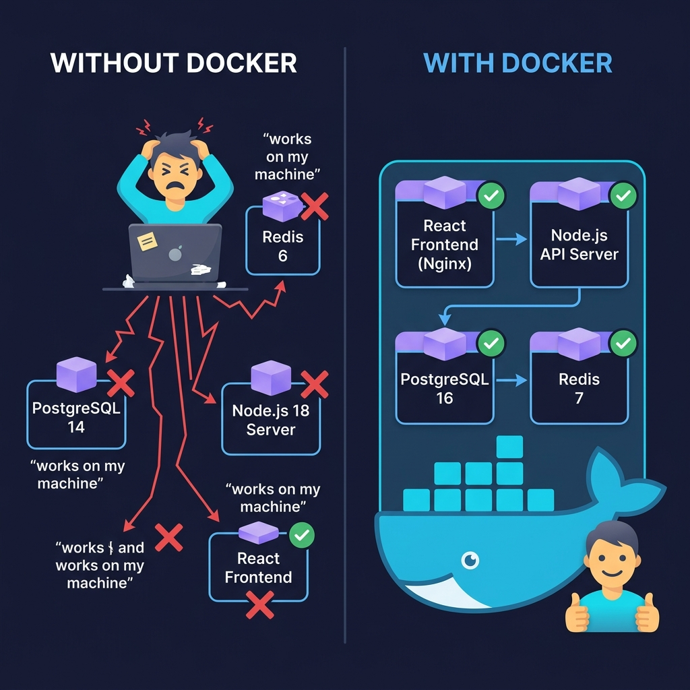
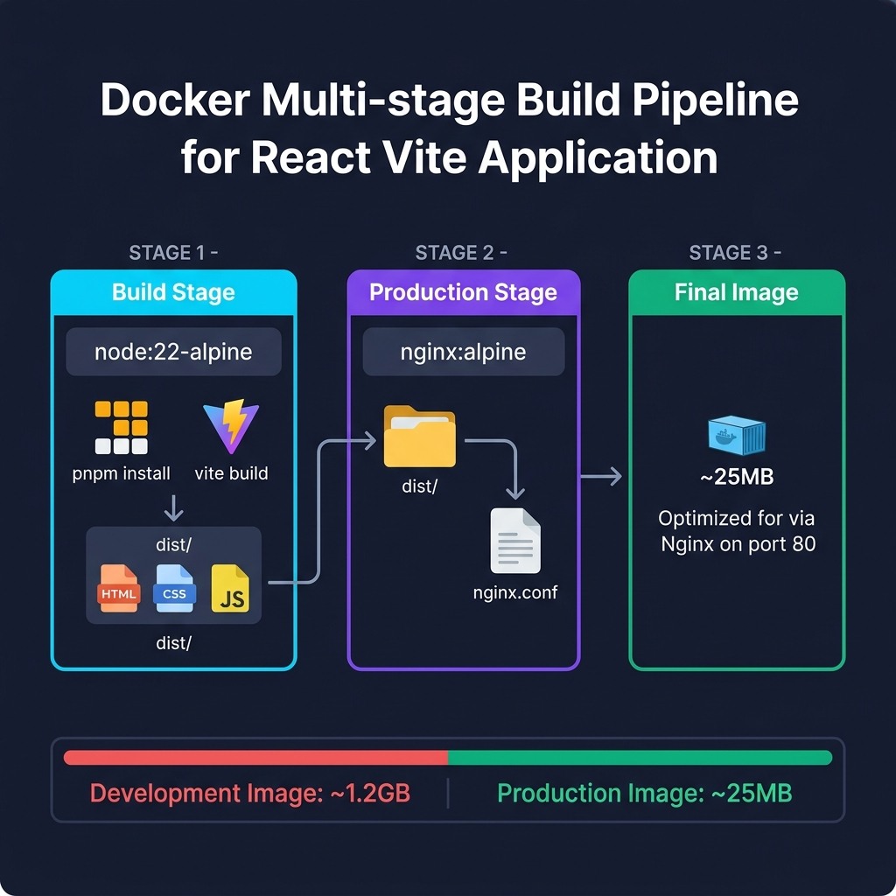
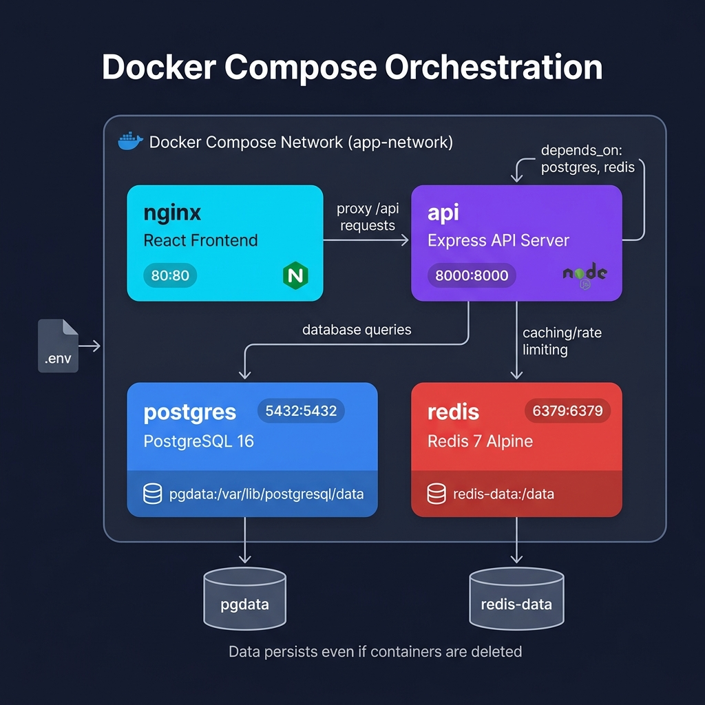
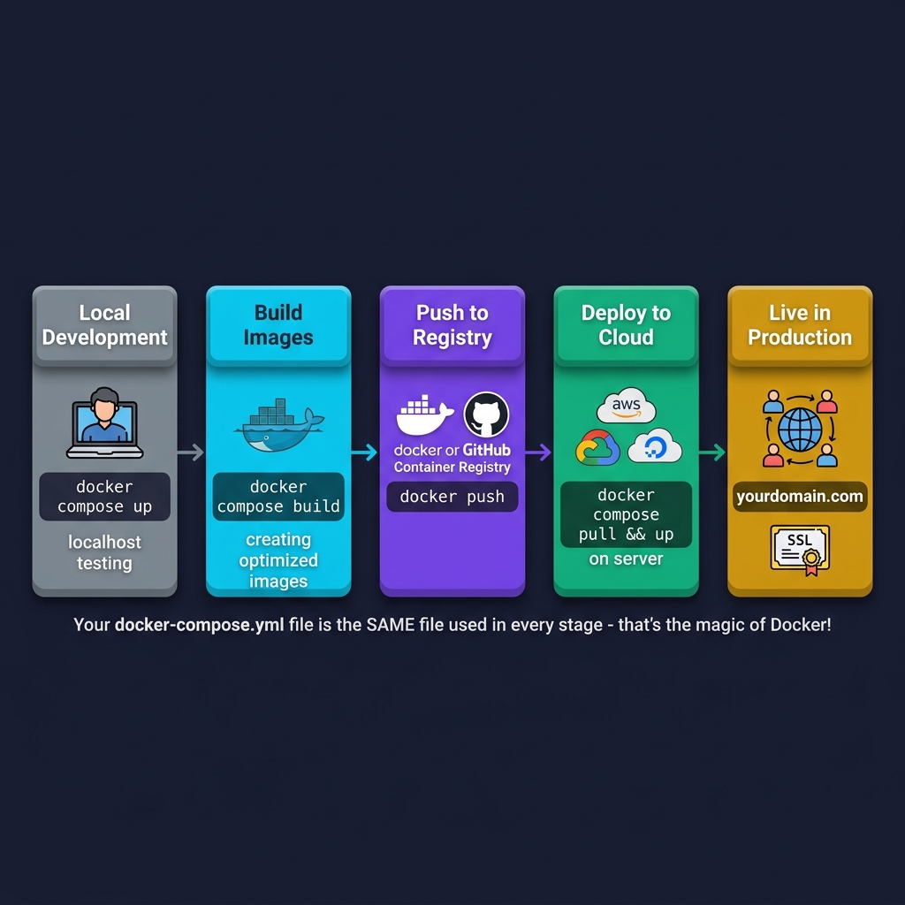

# 📊 Docker Implementation — Visual Guide

> An infographic-style overview of the RoleControl IAM Docker architecture. This document provides a visual summary of the concepts detailed in the main implementation guide.

---

## 1. The Containerization Shift

---

## 2. Client Multi-Stage Build Pipeline

---

## 3. Compose Orchestration Workflow

---

## 4. Deployment Pipeline

