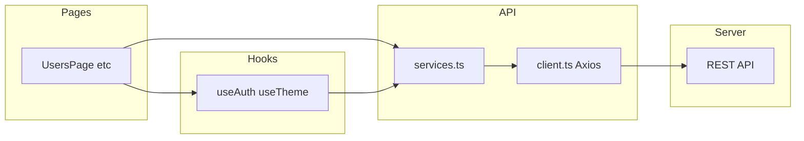

# 11. Separation of concerns — how it works in this project

**Separation of concerns (SoC)** means each part of the codebase owns **one kind of problem**, and dependencies point **inward** toward stable abstractions. This chapter maps that principle to **directories and import rules** in this client.

For the high-level stack and folder tree, see [01 — Architecture Overview](./01-architecture-overview.md).

---

## 11.1 The layers (who owns what)

| Layer | Directory | Owns | Does not own |
|-------|-----------|------|----------------|
| **Route containers** | [`client/src/pages/`](../src/pages/) | Composing queries, mutations, forms, page layout | Axios details, cookie refresh logic |
| **Reusable behavior** | [`client/src/hooks/`](../src/hooks/) | Session query (`useAuthMe`), capabilities (`useCapabilities`), theme, confirm dialog | Feature-specific table markup |
| **HTTP + transport** | [`client/src/api/`](../src/api/) | `client.ts` (instance, interceptors), `services.ts` (URLs + verbs), generated `schema.ts`, `types.ts` aliases | React components, UI state |
| **Layout & chrome** | [`client/src/components/`](../src/components/) | `AppShell`, `ProtectedRoute`, pagination, design primitives (`ui.tsx`) | Domain CRUD for users/roles (except logout wiring noted below) |
| **Global client flags** | [`client/src/store/`](../src/store/) | `isAuthenticated` persistence | Server entities |
| **Pure helpers** | [`client/src/utils/`](../src/utils/) | Formatting, grouping logic | I/O |

**Bootstrap:** [`App.tsx`](../src/App.tsx) wires routes only; [`main.tsx`](../src/main.tsx) wires providers (`QueryClientProvider`, `BrowserRouter`).

---

## 11.2 Data flow (end to end)

- **Pages** call **hooks** and **`services`** inside React Query `queryFn` / `mutationFn`.
- **`services`** call **`request`**, which uses the shared Axios instance and interceptors.
- **UI primitives** (`Button`, `Panel`, `Field` in `ui.tsx`) receive props and callbacks; they **do not import** `services`.

---

## 11.3 Concrete import rules (today’s codebase)

### Who imports `../api/services`?

As of this documentation pass, **`services`** is imported from:

- **Feature pages** — [`AuthPage`](../src/pages/AuthPage.tsx), [`UsersPage`](../src/pages/UsersPage.tsx), [`RolesPage`](../src/pages/RolesPage.tsx), etc.
- **Auth hook** — [`useAuth.ts`](../src/hooks/useAuth.ts) for `authApi.me`.
- **App shell** — [`AppShell.tsx`](../src/components/AppShell.tsx) for **`authApi.logout`** (logout is a layout concern: it clears global session state and cache).

That is a deliberate exception: `AppShell` is a **smart layout**, not a presentational atom. If logout moved to a dedicated hook, imports could narrow further — but the rule remains: **primitives stay dumb**.

### Who imports `../api/client`?

Typically **`services.ts`** and occasionally code that needs **`ApiClientError`** or **`getErrorMessage`**. Pages should prefer **`services`** so URLs stay centralized.

---

## 11.4 Server state vs client state (SoC across paradigms)

- **React Query** owns **server-backed** data and cache invalidation ([07](./07-react-query.md)).
- **Zustand** owns **one client flag** for auth UX ([08](./08-zustand.md)).

Mixing them (e.g. storing the user list in Zustand) would **duplicate** the server and break the invalidation pattern — a SoC violation in this architecture.

---

## 11.5 Contract-driven types (boundary with the backend)

The frontend does not invent DTO shapes by hand for API payloads. Types flow from OpenAPI → `schema.ts` → `types.ts` ([12](./12-openapi-typescript-contract.md)). That is SoC between **teams**: the backend contract is the single source of truth for **what** crosses the wire.

---

## 11.6 Related docs

- [01 — Architecture Overview §1.3–1.5](./01-architecture-overview.md)
- [06 — Code Patterns](./06-patterns-strengths-weaknesses.md) — contributor conventions
- [03 — Network Layer](./03-network-layer.md)
- [07 — React Query](./07-react-query.md)
