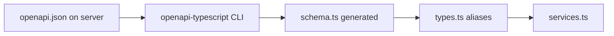

# 12. OpenAPI → TypeScript contract — crash course + this project

This client treats the backend **OpenAPI** document as the **single source of truth** for request/response shapes. TypeScript types are **generated**, not hand-written from guesswork. This chapter explains **why**, **how to regenerate**, and **how the files fit together**.

---

## 12.1 Why contract-driven types

Without codegen, the frontend and backend **drift**: a field rename breaks production silently until runtime. With OpenAPI + TypeScript:

- **`services.ts`** return types match the API.
- **`useCapabilities().can(...)`** accepts only real **`CapabilityKey`** values.
- Form payloads use the same `CreateUserRequest` shape the server validates.

When the API changes, you **regenerate** and the compiler points at every broken callsite.

---

## 12.2 The generation command

**Defined in:** [`client/package.json`](../package.json)

```bash
pnpm run generate:types
```

**What it runs:**

```text
openapi-typescript ../server/openapi/openapi.json -o src/api/schema.ts
```

**Inputs:** [`server/openapi/openapi.json`](../../server/openapi/openapi.json) (path relative to `client/`).  
**Output:** [`client/src/api/schema.ts`](../src/api/schema.ts)

---

## 12.3 `schema.ts` — generated (do not edit)

`openapi-typescript` emits a large module of `paths`, `components`, `operations`, etc. You **should not hand-edit** this file — the next run would overwrite your changes.

You **do** read from it indirectly via [`types.ts`](../src/api/types.ts).

---

## 12.4 `types.ts` — friendly aliases and small extensions

**File:** [`client/src/api/types.ts`](../src/api/types.ts)

This file:

1. Imports `components` from `./schema`.
2. Defines `type Schemas = components['schemas']`.
3. Exports **named aliases** such as `UserSummary`, `AuthMeData`, `CapabilityKey`, `PaginationQuery`, etc.
4. Defines a few **frontend-only** types that are not in the OpenAPI list models (e.g. `GroupedRolePermission`).
5. Exports **`const` arrays** with `satisfies` for compile-time checks against schema unions — e.g. `roleNames`, `permissionActions` — so dropdowns and forms stay aligned with the contract.

**Example pattern:**

```ts
export type CapabilityKey = Schemas['CapabilityKey']
```

If the backend removes or renames a capability in OpenAPI, regeneration updates `CapabilityKey` and TypeScript errors on every `can("...")` callsite.

---

## 12.5 How services consume the contract

**File:** [`client/src/api/services.ts`](../src/api/services.ts)

Each method uses **`request<SomeType>({ method, url, ... })`** where `SomeType` is imported from `./types`. The Axios layer returns the unwrapped `data` payload ([10 — Axios](./10-axios-and-interceptors.md)), so the generic matches the **inner** success body the backend documents.

---

## 12.6 Workflow when the backend changes

1. Update the server and its exported OpenAPI JSON.
2. From `client/`, run **`pnpm run generate:types`**.
3. Run **`pnpm run typecheck`** (or let the IDE show errors).
4. Fix callsites — the compiler lists mismatches.

If you skip regeneration, the frontend **lies** to TypeScript about the API — treat stale `schema.ts` as technical debt.

---

## 12.7 Mental model (one diagram)



---

## 12.8 Related docs

- [01 — Architecture Overview §1.2–1.3](./01-architecture-overview.md)
- [03 — Network Layer](./03-network-layer.md)
- [09 — Feature flags and capabilities](./09-feature-flags-and-capabilities.md) — `CapabilityKey`
- [11 — Separation of concerns](./11-separation-of-concerns.md)
