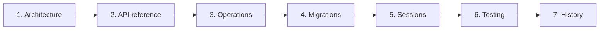

# Server documentation

Reference docs for the Express + PostgreSQL + Redis backend. Read them in the
order below; each one ends with a link to the next.

## Contents

| # | Doc | Answers |
| --- | --- | --- |
| 1 | [Architecture](./architecture.md) | What the layers are, how a request flows, how auth and authorization actually decide |
| 2 | [API reference](./api.md) | Every route, its middleware, and the response envelope |
| 3 | [Operations](./operations.md) | How to run it, which command destroys data, what every env var is for |
| 4 | [Migrations](./migrations_docs/README.md) | How the schema changes without a reset |
| 5 | [Session management](./session_management/README.md) | Logout, admin revocation, and the 2-row cap |
| 6 | [Testing](./testing.md) | The five suites, what each covers, what they need |
| 7 | [Testing history](./testing-history/README.md) | Recorded results per suite version |

## Where the truth lives

These docs describe the code. When they disagree with it, the code wins. Three
places are authoritative on their own:

| Question | Authority |
| --- | --- |
| What does the API accept and return? | [openapi/openapi.json](../openapi/openapi.json), generated from [api.contracts.ts](../src/contracts/api.contracts.ts) |
| What is the schema? | [migrations/](../migrations), not `db.setup.ts` |
| Can this role do this? | `checkRolePermissions` reading `role_permissions`, not `PERMISSION_HIERARCHY` |

## Related

- [server/README.md](../README.md), project overview and quick start.
- [server/tests/README.md](../tests/README.md), suite-local notes.
- [report/](../../report/index.md), the security and design audit, 23 vulnerabilities and 20 suggestions.
- [server/learning_readme/](../learning_readme), study notes and design history. Not maintained as reference.

---

Previous: [server/README.md](../README.md).
Next: [Architecture](./architecture.md).
