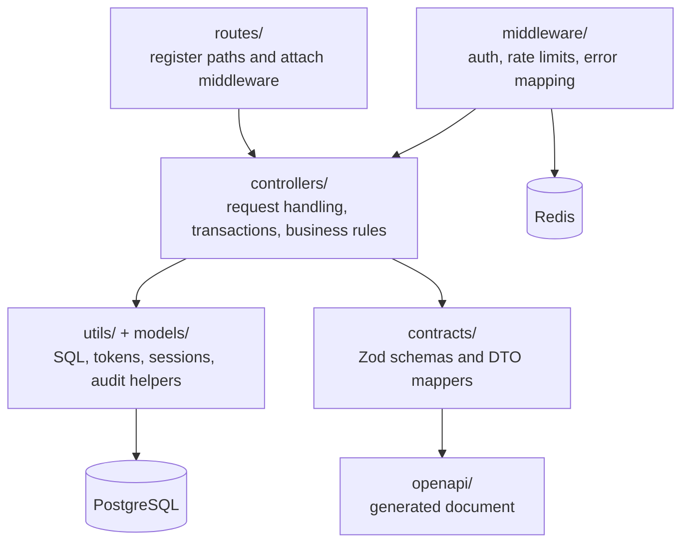
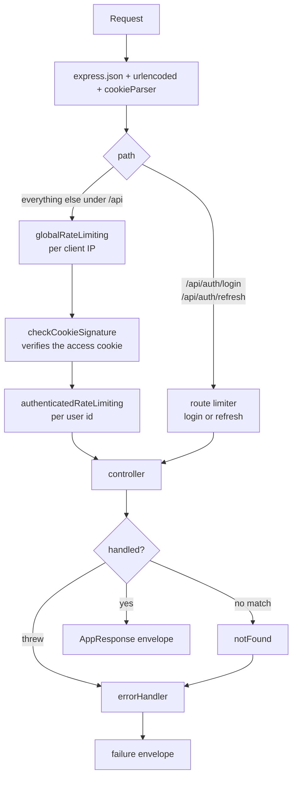
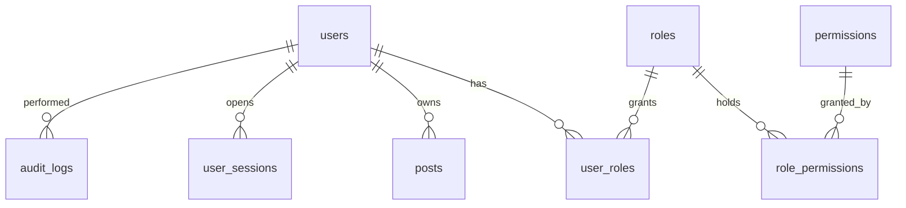
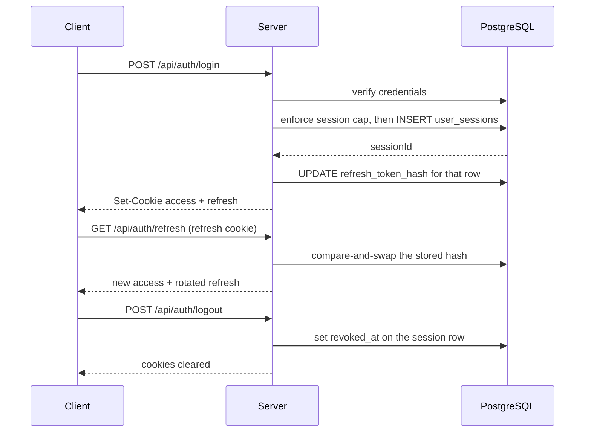
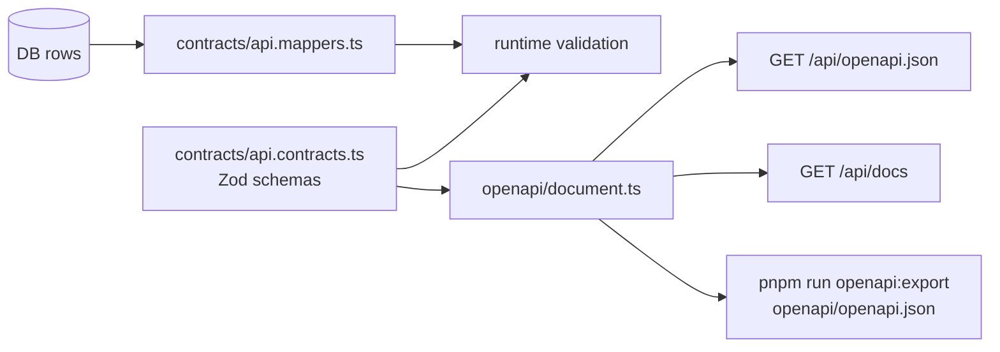

# Architecture

A modular Express 5 backend in TypeScript. PostgreSQL holds the authority data
for users, roles, permissions, sessions, posts and audits. Redis backs the rate
limiters only, so a Redis outage degrades throttling, not correctness.

## Layers

| Layer | Owns | Does not own |
| --- | --- | --- |
| `routes/` | path shape, middleware order | any business rule |
| `controllers/` | transaction boundaries, authorization decisions, responses | raw response shaping |
| `middleware/` | authentication, rate limiting, error normalization | resource-specific rules |
| `contracts/` | request schemas, response DTOs, envelope shapes | persistence details |
| `openapi/` | the published document | validation at runtime |

## Request pipeline

The order in [src/app.ts](../src/app.ts) is deliberate. `login` and `refresh`
mount before the global limiter so a throttled client can still authenticate.

| Stage | File |
| --- | --- |
| Trust proxy and body parsing | [src/app.ts](../src/app.ts) |
| Login limiter | [loginRateLimiting.middleware.ts](../src/middleware/loginRateLimiting.middleware.ts) |
| Refresh limiter | [refreshRateLimiting.middleware.ts](../src/middleware/refreshRateLimiting.middleware.ts) |
| Global limiter | [globalRateLimiting.middleware.ts](../src/middleware/globalRateLimiting.middleware.ts) |
| Access cookie check | [checkCookieSignature.middleware.ts](../src/middleware/checkCookieSignature.middleware.ts) |
| Per-user limiter | [authenticatedRateLimiting.middleware.ts](../src/middleware/authenticatedRateLimiting.middleware.ts) |
| Error normalization | [errorHandler.middleware.ts](../src/middleware/errorHandler.middleware.ts) |

## Data model

- Posts point at their author through `owner_id`.
- Audit rows keep before and after snapshots and use `ON DELETE SET NULL` for attribution, so deleting a user does not erase the trail.
- Both join tables carry a unique constraint on the pair.

Migrations in [migrations/](../migrations) are the schema source of truth. The
destructive helper is for disposable resets only, see [Operations](./operations.md).

## Authentication

Cookie-based, two JWTs, both signed with the same secret.

| Token | Claims | Read by |
| --- | --- | --- |
| access | `uId`, `email` | `checkCookieSignature` on every protected router |
| refresh | `uId`, `sId`, `type: "refresh"` | the refresh and logout controllers |

Session cap: login allows 2 rows per user, enforced by
[enforceSessionRowCapPerUser](../src/utils/session.util.ts). When a third login
arrives, the oldest row is deleted first.

Relevant files: [login.ts](../src/controllers/auth/login.ts),
[refreshToken.ts](../src/controllers/auth/refreshToken.ts),
[logout.ts](../src/controllers/auth/logout.ts),
[jsonWebTokens.ts](../src/utils/jsonWebTokens.ts).

> [!WARNING]
> The access token carries no `type` claim, so a refresh token satisfies the
> access check, and `checkCookieSignature` never reads `user_sessions`. Revoking
> a session therefore does not end it. See
> [vulnerability 01](../../report/vulnerabilities/01.jwt-token-confusion-and-session-revocation-bypass.md).

## Authorization

Permission checks read the database on every request, so a role change takes
effect on the next request rather than the next login. Three things look like
the rule book, and only one of them is.

| Source | What it is | Used at runtime |
| --- | --- | --- |
| `checkRolePermissions(...)` in [helper.ts](../src/utils/helper.ts) | effective permissions resolved from `user_roles` and `role_permissions` | yes, this is the decision |
| `ROLE_RANKS` in [hierarchy.ts](../src/config/hierarchy.ts) | `user` 1, `editor` 2, `admin` 3, `super-admin` 4 | yes, for peer and escalation guards |
| `PERMISSION_HIERARCHY` in the same file | reference data for the seeder | no |

## Contracts and OpenAPI

One Zod definition drives request validation, the response DTO and the published
spec, so the three cannot drift apart.

Mappers exist so persistence rows never reach a client untouched. Files:
[api.contracts.ts](../src/contracts/api.contracts.ts),
[api.mappers.ts](../src/contracts/api.mappers.ts),
[document.ts](../src/openapi/document.ts),
[export.ts](../src/openapi/export.ts).

## Audit logging

Sensitive mutations write to `audit_logs` through `auditDBMutation` in
[helper.ts](../src/utils/helper.ts). The pattern is one transaction for both
writes:

1. Run the business mutation on the transaction client.
2. Insert the audit row on the same client.
3. Commit once, so a failed mutation cannot leave an orphan audit row.

---

Previous: [server/README.md](../README.md) for what the project is.
Next: [API reference](./api.md) for the routes these layers expose.
