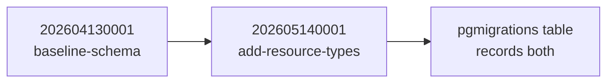

# Database migrations

Database migrations are SQL files that version schema and seed-data changes.
They let the project evolve without dropping and recreating all application
tables.

## Why migrations

The original `db.setup.ts` reset workflow is useful for early local learning,
but it is destructive. Incremental migrations preserve existing data while
recording each database change in source control.

## Workflow

The server uses `node-pg-migrate` through package scripts:

- `pnpm run migrate:create` creates a new SQL migration file.
- `pnpm run migrate:up` applies pending migrations.
- `pnpm run migrate:down` rolls back the latest migration.
- `pnpm run migrate:status` shows applied and pending migrations.

Applied migrations are tracked in the `pgmigrations` table.

## Current migrations

`202604130001_baseline-schema.sql` creates the original schema: users, roles,
permissions, user-role assignments, role-permission assignments, posts,
sessions, and audit logs.

`202605140001_add-resource-types.sql` widens resource CHECK constraints for
`audit_log`, `session`, and `migration`, then seeds the permissions needed by
the audit-log, migration-status, and session-management endpoints.

## Applied order

Migration files live in [migrations/](../../migrations). The runner is
[db.migrate.ts](../../src/config/db.migrate.ts).

---

Previous: [Operations](../operations.md) for the commands that drive these.
Next: [Session management](../session_management/README.md), the feature the second migration unlocked.
