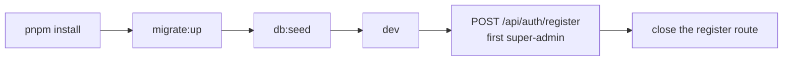

# Operations

How to run this server, what each command does to your data, and which settings
matter outside localhost.

## Prerequisites

| Requirement | Why |
| --- | --- |
| Node with `tsx` (installed by `pnpm install`) | every script runs TypeScript directly |
| PostgreSQL reachable from `.env` | all authority data |
| Redis reachable from `.env` | rate limiting, degrades open when down |
| A real `JWT_SECRET` | placeholders are accepted at boot and are a known finding |

## First run

```bash
pnpm install
pnpm run migrate:up   # create the schema
pnpm run db:seed      # insert reference roles and permissions
pnpm run dev          # tsx watch index.ts
```



`register` is open on purpose for that first account only. See
[API reference](./api.md#auth).

## Command reference

| Command | Effect | Safe against real data |
| --- | --- | --- |
| `pnpm run dev` | starts the watcher on `index.ts` | yes |
| `pnpm run build` | `tsc` into `dist/` | yes |
| `pnpm start` | runs `dist/index.js` | yes |
| `pnpm run migrate:up` | applies pending migrations | yes |
| `pnpm run migrate:down` | reverts the last migration | no |
| `pnpm run migrate:status` | lists applied and pending | yes |
| `pnpm run migrate:create` | scaffolds a SQL migration file | yes |
| `pnpm run db:seed` | inserts roles, permissions, role-permission mappings | yes, idempotent |
| `pnpm run db:setup` | **drops every table**, then recreates them | no |
| `pnpm run openapi:export` | writes [openapi/openapi.json](../openapi/openapi.json) | yes |

> [!CAUTION]
> `pnpm run db:setup` runs [db.setup.ts](../src/config/db.setup.ts), which drops
> the existing tables before recreating them. Use it on a local or disposable
> database only. Migrations are the normal path.

Seeding is bootstrap work, not a per-release deploy step. Run it when you are
initializing an environment or repairing reference data.

## Environment

[src/utils/envHelper.ts](../src/utils/envHelper.ts) parses and validates every
variable at boot, so a missing or malformed value fails fast instead of surfacing
as a runtime error later. There is no `.env.example` in the repo yet; the table
below is the current set.

| Group | Variables |
| --- | --- |
| Server | `PORT`, `HOST`, `NODE_ENV`, `SHUTDOWN_GRACE_MS` |
| PostgreSQL | `DB_NAME`, `DB_HOST_NAME`, `DB_PORT`, `DB_USER`, `DB_PASSWORD`, `DATABASE_URL`, `DB_SERVER_GROUP_NAME`, `DB_SERVER_NAME` |
| Auth | `JWT_SECRET`, `SALT_ROUNDS`, `ACCESS_TOKEN_EXPIRES_IN`, `REFRESH_TOKEN_EXPIRES_IN` |
| Redis | `REDIS_HOST`, `REDIS_PORT`, `REDIS_URL` |
| Proxy | `TRUST_PROXY` |
| Login limits | `RATE_LIMIT_LOGIN_IP_LIMIT`, `RATE_LIMIT_LOGIN_IP_WINDOW_MS`, `RATE_LIMIT_LOGIN_FAIL_LIMIT`, `RATE_LIMIT_LOGIN_FAIL_WINDOW_MS` |
| Refresh limits | `RATE_LIMIT_REFRESH_IP_LIMIT`, `RATE_LIMIT_REFRESH_IP_WINDOW_MS`, `RATE_LIMIT_REFRESH_SESSION_LIMIT`, `RATE_LIMIT_REFRESH_SESSION_WINDOW_MS` |
| Global and per-user limits | `RATE_LIMIT_GLOBAL_IP_LIMIT`, `RATE_LIMIT_GLOBAL_IP_WINDOW_MS`, `RATE_LIMIT_USER_LIMIT`, `RATE_LIMIT_USER_WINDOW_MS` |

## Rate limiting and Redis

Redis is a live runtime dependency, wired through
[redis.connect.ts](../src/config/redis.connect.ts) and
[rateLimit.util.ts](../src/utils/rateLimit.util.ts).

| Limiter | Keyed by | Applies to |
| --- | --- | --- |
| `loginRateLimiting` | client IP and failure count | `POST /api/auth/login` |
| `refreshRateLimiting` | client IP and session | `GET /api/auth/refresh` |
| `globalRateLimiting` | client IP | everything under `/api` except the two auth routes above |
| `authenticatedRateLimiting` | `user.uId` | every protected router |

All four fail open. When Redis is unreachable the middleware logs a warning and
lets the request through, which keeps the API available and removes the throttle
at the same time. That tradeoff is deliberate and recorded in
[vulnerability 07](../../report/vulnerabilities/07.rate-limiters-fail-open.md).

## Cookies and proxies

Auth cookies are set with `httpOnly: true`, `secure: true`, `sameSite: "strict"`
in [src/others/constants.ts](../src/others/constants.ts).

- `secure: true` means browsers will not store them over plain HTTP, so local testing needs HTTPS or a proxy that terminates it.
- `TRUST_PROXY` is parsed in [app.ts](../src/app.ts) and accepts `true`, `false`, a hop count, or an IP list.
- Behind Nginx or a load balancer, `TRUST_PROXY` must match the real hop count. Too high and clients can spoof their IP, which moves them into someone else's rate-limit bucket. See [vulnerability 22](../../report/vulnerabilities/22.trust-proxy-misconfiguration-enables-limit-bypass.md).

## Shutdown

[index.ts](../index.ts) handles `SIGINT` and `SIGTERM`, closes the HTTP server,
then exits. Database and Redis connections are not closed yet; the `TODO` marking
that is still in the file.

## Production readiness

| Present | Missing |
| --- | --- |
| Migration-based schema evolution | CI |
| Redis-backed rate limiting | structured logging and request ids |
| OpenAPI and Swagger exposure | health and readiness endpoints |
| Secure cookie defaults | containerization |
| Proxy-aware Express config | connection closing on shutdown |

Each gap has a matching entry in
[report/suggestions](../../report/suggestions/index.md).

---

Previous: [API reference](./api.md).
Next: [Migrations](./migrations_docs/README.md) for how the schema evolves.
