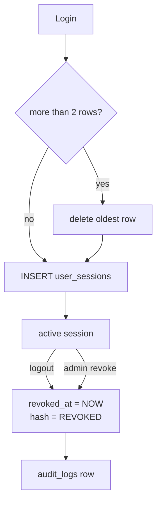

# Session management

This project stores refresh-token sessions in `user_sessions`. Admin session
revocation is a soft revoke: the row stays available for audit and inspection,
but it can no longer validate refresh-token rotation.

## Admin revocation

`PATCH /api/sessions/:sessionId/revoke` revokes one active session. It requires
the `revoke:session` permission, updates `revoked_at` and `expires_at` to
`NOW()`, replaces `refresh_token_hash` with `REVOKED`, and writes a `revoke`
audit log for the session id.

`PUT /api/users/:userId/sessions/revoke-all` revokes every active session for a
target user. It requires the stronger `delete:session` permission, applies the
same soft-revoke update to all active rows, and writes a `delete` audit log
against the user id with `revokedCount` and `revokedSessionIds` metadata.

## Logout against admin revocation

`POST /api/auth/logout` is the user self-service path. It clears auth cookies
and revokes the current refresh session when the refresh cookie can be
validated.

Admin revocation is an operational path for managing another user's sessions.
It uses RBAC permissions and audit logging so session administration remains
traceable.

## Session row cap

`enforceSessionRowCapPerUser` keeps each user under
`MAX_SESSION_ROWS_PER_USER = 2` during login/refresh flows by deleting the
oldest excess rows before a new session is inserted. This cleanup is separate
from admin revocation: revocation preserves rows for visibility, while the row
cap prevents unbounded session-table growth.

## RBAC split

`revoke:session` allows single-session revocation and is assigned to `admin`
and `super-admin`.

`delete:session` allows bulk revocation of all active sessions for one user and
is assigned only to `super-admin`.

## The three ways a session ends

| Path | Trigger | Row afterwards | Permission |
| --- | --- | --- | --- |
| Self logout | `POST /api/auth/logout` | revoked, kept | none, uses the refresh cookie |
| Admin revoke one | `PATCH /api/sessions/:sessionId/revoke` | revoked, kept, audited | `revoke:session` |
| Admin revoke all | `PUT /api/users/:userId/sessions/revoke-all` | all active rows revoked, kept, audited | `delete:session` |
| Row cap eviction | third login by the same user | oldest row deleted | none, automatic |

Controllers: [revokeSession.ts](../../src/controllers/sessions/revokeSession.ts),
[revokeAllUserSessions.ts](../../src/controllers/sessions/revokeAllUserSessions.ts).
Cap helper: [session.util.ts](../../src/utils/session.util.ts).

> [!WARNING]
> Revocation marks the row but `checkCookieSignature` never reads
> `user_sessions`, so a revoked session's access token keeps working until it
> expires. See
> [vulnerability 01](../../../report/vulnerabilities/01.jwt-token-confusion-and-session-revocation-bypass.md).

---

Previous: [Migrations](../migrations_docs/README.md).
Next: [Server documentation index](../README.md), back to the start.
