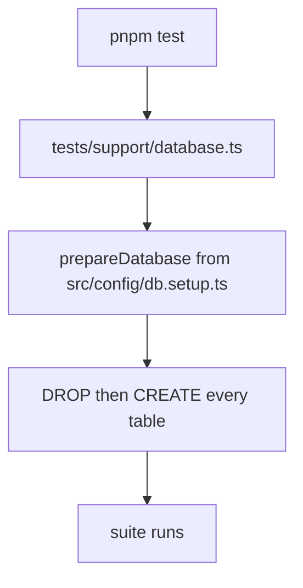

# Testing

Five versioned suites run on Node's built-in test runner through `tsx`, one file
per suite, always with `--test-concurrency=1` because every suite shares one
database.

## Suites

| Suite | Command | Role | Entry point |
| --- | --- | --- | --- |
| v1 | `pnpm test:v1` | archived, kept for history | [tests/v1-archive](../tests/v1-archive) |
| v2 | `pnpm test` or `pnpm test:v2` | main integration regression | [tests/v2-integration/index.test.ts](../tests/v2-integration/index.test.ts) |
| v3 | `pnpm test:v3` | migration verification | [tests/v3-migrations/index.test.ts](../tests/v3-migrations/index.test.ts) |
| v4 | `pnpm test:v4` | rate limiter behaviour | [tests/v4-rate-limits/index.test.ts](../tests/v4-rate-limits/index.test.ts) |
| v5 | `pnpm test:v5` | OpenAPI contract | [tests/v5-openapi/index.test.ts](../tests/v5-openapi/index.test.ts) |

`pnpm test` and `pnpm test:v2` point at the same file, so the bare command runs
the regression suite.

## What each suite covers

**v2, integration.** Bootstrap registration lock, invalid login, refresh rotation
and replay rejection, revoked and expired session refusal, logout idempotency and
cookie clearing, the session cap, unauthenticated denial, the user CRUD flow,
self password-change protection, self-delete and hierarchy denials, role CRUD,
role assign and revoke including the duplicate conflict, permission CRUD with the
duplicate conflict, role-permission assign, list and revoke, post CRUD, the
create-on-behalf flow with its self-behalf guard, the admin against super-admin
post-delete guard, and audit-log payload checks on the important mutations.

**v3, migrations.** Baseline schema creation from an empty database, rerun
idempotency, RBAC seed idempotency after migration, then a full bootstrap through
login, session creation, audit logging and protected access on the migrated
schema.

**v4, rate limits.** Global limiter enforcement on non-exempt routes, the auth
exemptions, bucket separation by client IP, and fail-open behaviour when the
Redis-side check degrades.

**v5, OpenAPI.** Document generation, presence of the documented key routes, and
presence of the documented security schemes.

## Before you run them



> [!CAUTION]
> The suites destroy and recreate the schema through
> [prepareDatabase](../src/config/db.setup.ts). Point them at a local or
> dedicated disposable database, never at shared or real data.

| Requirement | Needed by |
| --- | --- |
| PostgreSQL reachable from `.env` | all suites |
| A DB user allowed to drop and recreate the schema | all suites |
| Redis reachable | v4, and any suite touching a limiter path |
| Migrations applied and RBAC reseeded | v3 does this itself |

Shared helpers live in [tests/support](../tests/support): `database.ts` for
schema lifecycle, `http.ts` for requests, `redis.ts` for limiter state.

## Latest verified runs

| Suite | Date | Command | Result |
| --- | --- | --- | --- |
| v2 | 2026-04-12 | `pnpm test` | 21 passed, 0 failed |
| v3 | 2026-04-14 | `pnpm run test:v3` | 4 passed, 0 failed |
| v4 | 2026-04-23 | `pnpm test:v4` | 5 passed, 0 failed |
| v5 | 2026-04-23 | `pnpm test:v5` | 1 passed, 0 failed |

Per-version history and findings: [docs/testing-history](./testing-history/README.md).
Suite-local notes: [tests/README.md](../tests/README.md).

## Known gap

The authorization matrix is sampled, not exhaustive. Every finding in
[report/vulnerabilities](../../report/vulnerabilities/index.md) is a cell these
suites do not assert. Closing that is
[suggestion 15](../../report/suggestions/15.authorization-test-matrix.md).

## CI direction

Nothing runs automatically yet. The minimum useful pipeline:

```bash
pnpm exec tsc --noEmit
pnpm test:v2
pnpm test:v3
pnpm test:v4
pnpm test:v5
```

---

Previous: [Session management](./session_management/README.md).
Next: [report/index.md](../../report/index.md) for what these suites do not yet catch.
