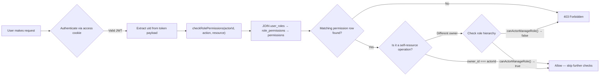
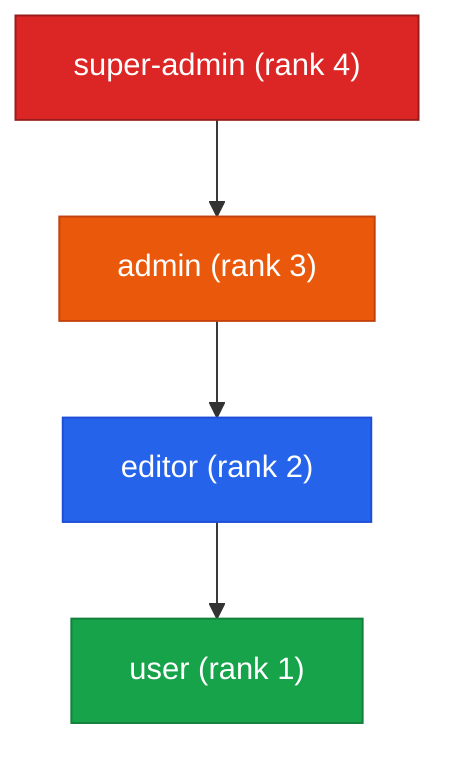
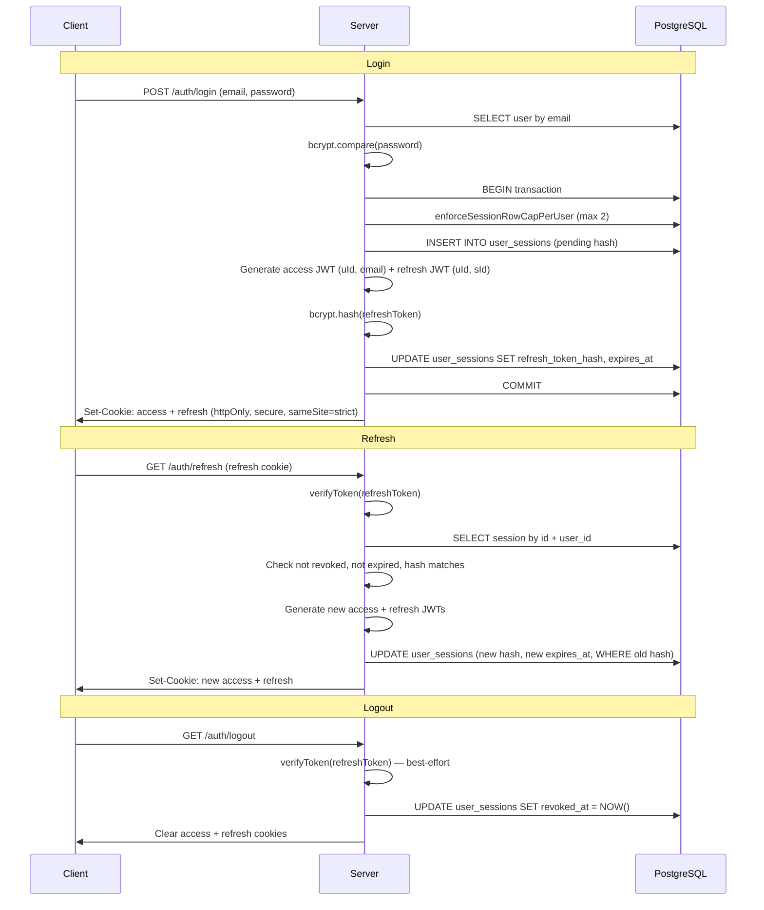
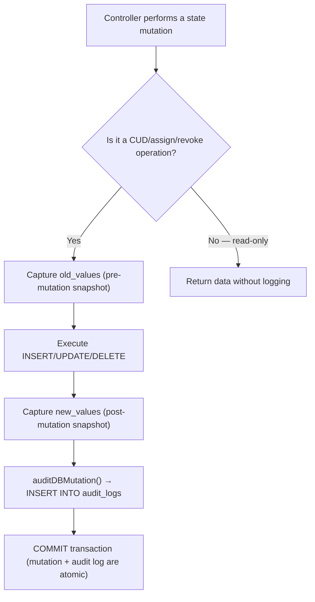

# RBAC Schema — Visual Diagrams

> Reflects the actual schema defined in [`db.setup.ts`](../src/config/db.setup.ts) and validated by Zod models in `src/models/`.

---

## 1. Entity-Relationship Diagram

```mermaid
erDiagram
    users ||--o{ user_roles : "has"
    roles ||--o{ user_roles : "assigned to"
    roles ||--o{ role_permissions : "has"
    permissions ||--o{ role_permissions : "granted to"
    users ||--o{ posts : "owns (owner_id)"
    users ||--o{ posts : "acted on behalf (behalf_of)"
    users ||--o{ users : "created (created_by)"
    users ||--o{ user_sessions : "authenticates via"
    users ||--o{ audit_logs : "actor of (actor_id)"

    users {
        SERIAL id PK
        VARCHAR_150 fullname "NOT NULL"
        VARCHAR_255 email "NOT NULL UNIQUE"
        VARCHAR_255 password "NOT NULL"
        BOOLEAN is_active "NOT NULL DEFAULT TRUE"
        TIMESTAMPTZ created_at "NOT NULL DEFAULT NOW()"
        INT created_by FK "REFERENCES users(id) ON DELETE SET NULL"
    }

    roles {
        SERIAL id PK
        VARCHAR_50 name "NOT NULL UNIQUE"
        TEXT description "nullable"
    }

    permissions {
        SERIAL id PK
        VARCHAR_50 action "NOT NULL, CHECK IN actions_list"
        VARCHAR_50 resource "NOT NULL, CHECK IN resources_list"
        TEXT description "nullable"
    }

    user_roles {
        SERIAL id PK
        INT user_id FK "NOT NULL, REFERENCES users(id) ON DELETE CASCADE"
        INT role_id FK "NOT NULL, REFERENCES roles(id) ON DELETE CASCADE"
    }

    role_permissions {
        SERIAL id PK
        INT role_id FK "NOT NULL, REFERENCES roles(id) ON DELETE CASCADE"
        INT permission_id FK "NOT NULL, REFERENCES permissions(id) ON DELETE CASCADE"
    }

    posts {
        SERIAL id PK
        VARCHAR_255 title "NOT NULL"
        TEXT content "nullable"
        INT owner_id FK "NOT NULL, REFERENCES users(id) ON DELETE CASCADE"
        TIMESTAMPTZ created_at "NOT NULL DEFAULT NOW()"
        INT behalf_of FK "REFERENCES users(id) ON DELETE SET NULL"
    }

    user_sessions {
        SERIAL id PK
        INT user_id FK "NOT NULL, REFERENCES users(id) ON DELETE CASCADE"
        VARCHAR_255 refresh_token_hash "NOT NULL"
        TIMESTAMPTZ expires_at "NOT NULL"
        TIMESTAMPTZ revoked_at "nullable"
        TEXT device_info "nullable"
        TIMESTAMPTZ created_at "NOT NULL DEFAULT NOW()"
    }

    audit_logs {
        SERIAL id PK
        INT actor_id FK "REFERENCES users(id) ON DELETE SET NULL"
        VARCHAR_50 action_type "NOT NULL, CHECK IN actions_list"
        VARCHAR_50 resource_type "NOT NULL, CHECK IN resources_list"
        INT resource_id "NOT NULL"
        JSONB old_values "nullable"
        JSONB new_values "nullable"
        JSONB metadata "nullable"
        TIMESTAMPTZ created_at "NOT NULL DEFAULT NOW()"
    }
```

---

## 2. Constraints & Indexes

### Unique Constraints

| Table              | Columns                   | Purpose                        |
|--------------------|---------------------------|--------------------------------|
| `users`            | `email`                   | One account per email address  |
| `permissions`      | `(action, resource)`      | No duplicate permission combos |
| `user_roles`       | `(user_id, role_id)`      | A user can hold a role once    |
| `role_permissions`  | `(role_id, permission_id)` | A role gets a permission once  |

### CHECK Constraints

| Table         | Column          | Rule                                                  |
|---------------|-----------------|-------------------------------------------------------|
| `permissions` | `action`        | Must be one of `ACTIONS_LIST`                         |
| `permissions` | `resource`      | Must be one of `RESOURCES_LIST`                       |
| `audit_logs`  | `action_type`   | Must be one of `ACTIONS_LIST`                         |
| `audit_logs`  | `resource_type` | Must be one of `RESOURCES_LIST`                       |
| `posts`       | `behalf_of`     | `behalf_of IS NULL OR behalf_of != owner_id` (no self-behalf) |

### Allowed Values (from `constants.ts`)

| List             | Values                                                          |
|------------------|-----------------------------------------------------------------|
| `ACTIONS_LIST`   | `view`, `create`, `update`, `assign`, `revoke`, `delete`, `createOnBehalf` |
| `RESOURCES_LIST` | `permission`, `role`, `user`, `post`                            |
| `ROLES_LIST`     | `super-admin`, `admin`, `user`, `editor`                        |

### Database Indexes

| Index Name                        | Table            | Columns                                    |
|-----------------------------------|------------------|---------------------------------------------|
| `idx_users_created_by`            | `users`          | `created_by`                                |
| `idx_user_roles_role_id`          | `user_roles`     | `role_id`                                   |
| `idx_role_permissions_permission_id` | `role_permissions` | `permission_id`                          |
| `idx_posts_owner_id`             | `posts`          | `owner_id`                                  |
| `idx_posts_behalf_of`            | `posts`          | `behalf_of`                                 |
| `idx_user_sessions_user_id`      | `user_sessions`  | `user_id`                                   |
| `idx_user_sessions_expires_at`   | `user_sessions`  | `expires_at`                                |
| `idx_audit_logs_actor_id`        | `audit_logs`     | `actor_id`                                  |
| `idx_audit_logs_resource_lookup` | `audit_logs`     | `(resource_type, resource_id, created_at DESC)` |

---

## 3. Access Check Flow

**Key implementation details:**
- `checkRolePermissions()` runs a single SQL join across `user_roles → role_permissions → permissions` with `LIMIT 1`
- Self-resource operations (e.g. updating own post or own profile) bypass the permission check — the controller checks `actorId === owner_id` first
- For cross-user mutations, `canActorManageRole()` compares rank numbers from `ROLE_RANKS` to enforce hierarchy boundaries

---

## 4. Role Hierarchy Diagram

### Per-Role Permission Matrix (from `hierarchy.ts`)

| Permission              | user | editor | admin | super-admin |
|--------------------------|:----:|:------:|:-----:|:-----------:|
| `view:permission`        | ✅   | ✅     | ✅    | ✅          |
| `view:role`              | ✅   | ✅     | ✅    | ✅          |
| `view:user`              | ✅   | ✅     | ✅    | ✅          |
| `view:post`              | ✅   | ✅     | ✅    | ✅          |
| `create:post`            | ✅   | ✅     | ✅    | ✅          |
| `update:user`            |      | ✅     |       | ✅          |
| `update:post`            |      | ✅     |       | ✅          |
| `update:role`            |      | ✅     |       | ✅          |
| `assign:role`            |      |        | ✅    | ✅          |
| `revoke:role`            |      |        | ✅    | ✅          |
| `delete:user`            |      |        | ✅    | ✅          |
| `delete:post`            |      |        | ✅    | ✅          |
| `create:permission`      |      |        |       | ✅          |
| `delete:permission`      |      |        |       | ✅          |
| `assign:permission`      |      |        |       | ✅          |
| `revoke:permission`      |      |        |       | ✅          |
| `create:role`            |      |        |       | ✅          |
| `delete:role`            |      |        |       | ✅          |
| `create:user`            |      |        |       | ✅          |
| `createOnBehalf:post`    |      |        |       | ✅          |

### Hierarchy Guard Rules

| Actor          | Can manage                              | Additional restrictions                                                        |
|----------------|------------------------------------------|--------------------------------------------------------------------------------|
| `super-admin`  | all roles including other super-admins   | Cannot delete the **last** super-admin in the system                           |
| `admin`        | `editor` and `user` only                 | Cannot delete posts owned by a super-admin; cannot self-assign or self-revoke roles |
| `editor`       | N/A (cannot manage roles)               | Can only update resources — no create/delete of users or roles                 |
| `user`         | N/A (cannot manage roles)               | Can create own posts; self-update own profile                                  |

---

## 5. Session & Token Lifecycle

---

## 6. Audit Logging Pipeline

**All 17 audited operations across the codebase:**

| Controller                     | action_type      | resource_type | Captures                  |
|--------------------------------|------------------|---------------|---------------------------|
| `registration.ts`              | `create`         | `user`        | `new_values`              |
| `registration.ts`              | `assign`         | `role`        | `new_values` (×2 roles)   |
| `createUser.ts`                | `create`         | `user`        | `new_values`              |
| `createUser.ts`                | `assign`         | `role`        | `new_values` + `metadata` |
| `updateUser.ts`                | `update`         | `user`        | `old_values` + `new_values` + `metadata` (if password changed) |
| `deleteUser.ts`                | `delete`         | `user`        | `old_values`              |
| `createPost.ts`                | `create`         | `post`        | `new_values`              |
| `createPostOnBehalf.ts`        | `createOnBehalf` | `post`        | `new_values`              |
| `updatePost.ts`                | `update`         | `post`        | `old_values` + `new_values` |
| `deletePost.ts`                | `delete`         | `post`        | `old_values`              |
| `createRole.ts`                | `create`         | `role`        | `new_values`              |
| `updateRole.ts`                | `update`         | `role`        | `old_values` + `new_values` |
| `deleteRole.ts`                | `delete`         | `role`        | `old_values`              |
| `assignRole.ts`                | `assign`         | `role`        | `new_values` + `metadata` |
| `revokeRole.ts`                | `revoke`         | `role`        | `old_values` + `metadata` |
| `assignPermission.ts`          | `assign`         | `permission`  | `new_values` + `metadata` |
| `revokePermission.ts`          | `revoke`         | `permission`  | `old_values` + `metadata` |
| `createPermission.ts`          | `create`         | `permission`  | `new_values`              |
| `removePermission.ts`          | `delete`         | `permission`  | `old_values`              |
