# Refresh Token — Implementation Analysis

> Documents the complete refresh-token architecture as currently implemented, the security properties it provides, and known limitations.

---

## 1. Architecture Overview

This project uses a **dual-token pattern** with rotating refresh tokens persisted in PostgreSQL:

| Token     | Transport          | Payload                     | TTL (default)  | Purpose                    |
|-----------|--------------------|-----------------------------|----------------|----------------------------|
| `access`  | `Set-Cookie` (httpOnly, secure, sameSite=strict) | `{ uId, email }` | `20m` (configurable via `ACCESS_TOKEN_EXPIRES_IN`) | Authorize every API request |
| `refresh` | `Set-Cookie` (httpOnly, secure, sameSite=strict) | `{ uId, sId, type: "refresh" }` | `7d` (configurable via `REFRESH_TOKEN_EXPIRES_IN`) | Obtain a new token pair without re-login |

Both tokens are signed with **HS256**, issuer `s3nsh1-dev`, audience `RBAC-users`.

---

## 2. Token Lifecycle — Step by Step

### 2.1 Login (`POST /auth/login`)

```
1. Validate email + password (bcrypt.compare)
2. BEGIN transaction
3. Lock the user row (SELECT ... FOR UPDATE)
4. enforceSessionRowCapPerUser(userId, max=2)
       → evicts oldest sessions if user already has ≥ 2 active rows
5. INSERT placeholder session row (refresh_token_hash = "pending")
       → captures the auto-generated session `id`
6. Generate access JWT payload:  { uId, email }
   Generate refresh JWT payload: { uId, sId: sessionId, type: "refresh" }
7. Sign both tokens with env.JWT_SECRET
8. Hash the refresh token with bcrypt (same salt-rounds as passwords)
9. UPDATE the placeholder row with the real hash + computed expires_at
10. COMMIT
11. Set both tokens as httpOnly cookies → respond 200
```

**Key details:**
- The placeholder-then-update pattern ensures the `sessionId` (`sId`) is embedded in the refresh JWT payload *before* the hash is computed.
- The `FOR UPDATE` row lock on the user prevents race conditions during concurrent login requests.

### 2.2 Refresh (`GET /auth/refresh`)

```
1. Extract refresh token from cookie
2. Verify JWT signature + claims (algorithm, issuer, audience)
3. Extract uId and sId from payload; assert type === "refresh"
4. SELECT session row by (id=sId, user_id=uId)
       → reject if revoked_at IS NOT NULL  → "Session revoked"
       → reject if expires_at < NOW()      → "Session expired"
5. bcrypt.compare(rawRefreshToken, session.refresh_token_hash)
       → reject if mismatch               → "Invalid refresh token"
6. Fetch fresh user record (id, email, fullname)
7. Generate new access + refresh JWTs (same payload shapes)
8. Hash the new refresh token
9. UPDATE user_sessions SET refresh_token_hash, expires_at
       WHERE id AND user_id AND refresh_token_hash = <old_hash>
       → the old-hash WHERE clause prevents replay of stale tokens
10. Set new cookies → respond 200
```

**Security property — token rotation:**
Each refresh consumes the old token hash and replaces it. If an attacker replays a previously-used refresh token, the `WHERE refresh_token_hash = <old>` update returns 0 rows, and the request fails. This is **one-time-use rotation**.

### 2.3 Logout (`GET /auth/logout`)

```
1. Read refresh cookie (may be missing)
2. Best-effort: verify the token and extract sId + uId
3. UPDATE user_sessions SET revoked_at = COALESCE(revoked_at, NOW())
       WHERE id = sId AND user_id = uId
4. Clear both cookies (access + refresh)
5. Respond 200 — always succeeds, idempotent by design
```

The `COALESCE(revoked_at, NOW())` ensures a session can only be revoked once — repeat logouts are safe.

---

## 3. Session Management

### 3.1 Database Schema (`user_sessions`)

```sql
CREATE TABLE user_sessions (
  id                  SERIAL PRIMARY KEY,
  user_id             INT NOT NULL REFERENCES users(id) ON DELETE CASCADE,
  refresh_token_hash  VARCHAR(255) NOT NULL,
  expires_at          TIMESTAMPTZ NOT NULL,
  revoked_at          TIMESTAMPTZ,          -- non-null means revoked
  device_info         TEXT,                  -- captures User-Agent header
  created_at          TIMESTAMPTZ NOT NULL DEFAULT NOW()
);
```

**Indexes:**
- `idx_user_sessions_user_id` — fast lookup by user
- `idx_user_sessions_expires_at` — supports cleanup queries on expired sessions

### 3.2 Session Row Cap

The `enforceSessionRowCapPerUser()` utility ([`session.util.ts`](../src/utils/session.util.ts)) enforces a **maximum of 2 concurrent sessions per user**:

```
1. SELECT all sessions for user_id, ordered by created_at ASC, locked FOR UPDATE
2. Calculate how many need to be evicted: (existing_count - (max - 1))
3. DELETE the oldest sessions by ID
4. Verify deleted count matches expectation; throw on mismatch
```

This means logging in on a 3rd device automatically destroys the oldest session. The cap is configurable by changing `MAX_SESSION_ROWS_PER_USER` in `login.ts`.

### 3.3 Device Tracking

The login controller captures `req.get("user-agent")` and stores it in `device_info`. This enables future features like "active sessions" UI or suspicious-device alerts.

---

## 4. Security Properties

| Property                    | Status | How                                                                                   |
|-----------------------------|--------|----------------------------------------------------------------------------------------|
| **Token storage**           | ✅ Secure | httpOnly + secure + sameSite=strict cookies — no JavaScript access, no CSRF on cross-site |
| **Token rotation**          | ✅ Implemented | Each refresh rewrites the hash; old tokens become invalid                      |
| **Replay detection**        | ✅ Implemented | The `WHERE refresh_token_hash = <old>` clause rejects stale tokens             |
| **Session revocation**      | ✅ Implemented | `revoked_at` column; logout sets it; refresh rejects revoked sessions          |
| **Session cap**             | ✅ Implemented | Max 2 sessions per user; oldest evicted on new login                           |
| **Graceful logout**         | ✅ Implemented | Always clears cookies; best-effort DB update; never errors out to the client   |
| **Hash algorithm**          | ✅ Secure | Refresh tokens hashed with bcrypt (same salt rounds as passwords)              |
| **JWT algorithm**           | ✅ Secure | HS256 with strict verify options (algorithm, issuer, audience)                 |
| **Configurable TTLs**       | ✅ Implemented | `ACCESS_TOKEN_EXPIRES_IN` / `REFRESH_TOKEN_EXPIRES_IN` via env with Zod validation |

---

## 5. Token Payload Types

Defined in [`commonTypes.ts`](../src/types/commonTypes.ts):

```typescript
// Access token — attached to req.user by checkCookieSignature middleware
type USER_JWT_PAYLOAD_TYPE = {
  uId: number;       // user ID
  email: string;     // user email
} & JwtBaseClaims;

// Refresh token — only read during /auth/refresh and /auth/logout
type REFRESH_JWT_PAYLOAD_TYPE = {
  uId: number;       // user ID
  sId: number;       // session ID (user_sessions.id)
  type: "refresh";   // discriminator to reject access tokens being used as refresh
} & JwtBaseClaims;

type JwtBaseClaims = {
  iat: number;
  exp: number;
  iss: "s3nsh1-dev";
  aud: "RBAC-users";
};
```

---

## 6. Flow Diagram

```mermaid
sequenceDiagram
    participant C as Client
    participant S as Server
    participant DB as PostgreSQL

    rect rgb(30, 60, 30)
    Note over C,DB: Login Flow
    C->>S: POST /auth/login {email, password}
    S->>DB: Validate credentials + enforce session cap
    S->>DB: INSERT session → get sessionId
    S->>S: Sign access + refresh JWTs
    S->>DB: UPDATE session with bcrypt(refreshToken)
    S->>C: Set-Cookie: access, refresh
    end

    rect rgb(30, 30, 60)
    Note over C,DB: Normal API Usage
    C->>S: Any API request (access cookie auto-sent)
    S->>S: checkCookieSignature → verifyToken(access)
    S->>S: req.user = { uId, email }
    S->>C: 200 / 403 / etc.
    end

    rect rgb(60, 60, 20)
    Note over C,DB: Token Refresh (before access expires)
    C->>S: GET /auth/refresh (refresh cookie auto-sent)
    S->>S: verifyToken(refresh) → extract sId
    S->>DB: Validate session (not revoked, not expired, hash matches)
    S->>S: Generate new access + refresh pair
    S->>DB: UPDATE session hash + expires_at (WHERE old_hash)
    S->>C: Set-Cookie: new access, new refresh
    end

    rect rgb(60, 30, 30)
    Note over C,DB: Logout
    C->>S: GET /auth/logout
    S->>DB: SET revoked_at = NOW() (best-effort)
    S->>C: Clear cookies + 200
    end
```



---

## 7. Known Limitations & Improvement Areas

### 7.1 No Automatic Silent Refresh (Client-Side)

The server-side `/auth/refresh` endpoint is fully functional, but there is **no client interceptor** to automatically refresh tokens on `401` responses. Currently a client must:
1. Detect the `401` manually
2. Call `GET /auth/refresh`
3. Retry the original request

An Axios/Fetch interceptor with a request queue would make this seamless.

### 7.2 No Absolute Session Lifetime

Sessions can be extended indefinitely by repeatedly refreshing before expiry. A production system would add an `absolute_expires_at` column to enforce a hard upper limit (e.g. 30 days from login).

### 7.3 No Concurrent Refresh Guard

If two tabs fire `/auth/refresh` simultaneously with the same token, one succeeds (rewrites the hash) and the other fails (old hash no longer matches). This is secure but may cause UX friction. A mutex/queue on the client side would prevent this.

### 7.4 No Expired Session Cleanup

Expired/revoked session rows remain in `user_sessions` forever. A periodic `DELETE FROM user_sessions WHERE expires_at < NOW() OR revoked_at IS NOT NULL` cron job would keep the table lean.

### 7.5 Session Revocation is Per-Session

There is no "revoke all sessions for user" endpoint. Implementing this would be a simple `UPDATE user_sessions SET revoked_at = NOW() WHERE user_id = $1 AND revoked_at IS NULL`.

---

## 8. Configuration Reference

All token-related configuration lives in `.env`, validated by Zod in [`envHelper.ts`](../src/utils/envHelper.ts):

| Variable                    | Type   | Default    | Description                              |
|-----------------------------|--------|------------|------------------------------------------|
| `JWT_SECRET`                | string | —          | Secret key for HS256 signing             |
| `SALT_ROUNDS`               | number | `10`       | bcrypt cost factor for password + token hashing |
| `ACCESS_TOKEN_EXPIRES_IN`   | enum   | `"20m"`    | Access JWT lifetime (10m–15d supported)  |
| `REFRESH_TOKEN_EXPIRES_IN`  | enum   | `"7d"`     | Refresh JWT lifetime (10m–15d supported) |

Supported TTL values: `10m`, `20m`, …, `120m`, `1d`, `2d`, …, `15d` (defined in `JWT_EXPIRES_TIMELINE` constant).
