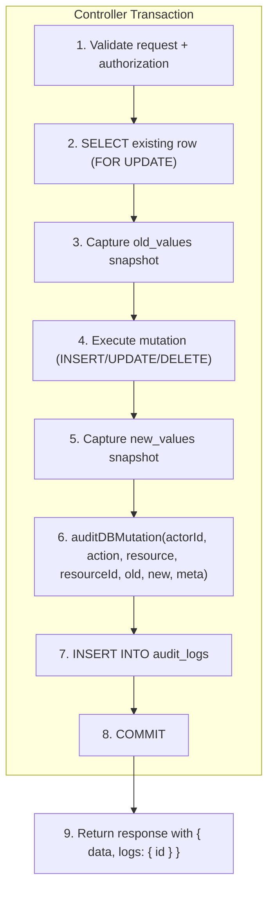
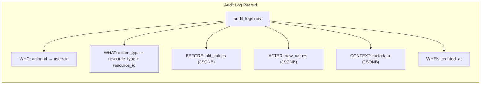

# Audit Logging — Implementation Analysis

> Documents the centralized audit trail system as currently implemented across the entire RBAC application.

---

## 1. Architecture — Centralized Audit Logging (Enterprise-Grade)

The project chose **Choice B: Centralized Audit Logging** — a single `audit_logs` table acts as a flight recorder for every state-mutating operation. Instead of adding `updated_by`, `updated_at`, `deleted_by`, `deleted_at` columns to every resource table, all change history flows through one immutable ledger.

### Why This Pattern?

| Concern                   | Fat-Model Approach               | Centralized Audit (implemented) |
|---------------------------|----------------------------------|---------------------------------|
| Schema bloat              | Every table grows 4+ columns      | One dedicated table             |
| Query "who changed what?" | Scattered across tables            | Single query on `audit_logs`    |
| Adding a new resource     | Must add tracking columns          | Just call `auditDBMutation()`   |
| JSONB diffs               | Not naturally supported            | `old_values` / `new_values`     |
| Metadata flexibility      | Rigid column schema                | `metadata` JSONB field          |

---

## 2. Database Schema

```sql
CREATE TABLE audit_logs (
  id            SERIAL PRIMARY KEY,
  actor_id      INT REFERENCES users(id) ON DELETE SET NULL,
  action_type   VARCHAR(50) NOT NULL CHECK (action_type IN (...ACTIONS_LIST)),
  resource_type VARCHAR(50) NOT NULL CHECK (resource_type IN (...RESOURCES_LIST)),
  resource_id   INT NOT NULL,
  old_values    JSONB,        -- snapshot BEFORE the mutation (null for creates)
  new_values    JSONB,        -- snapshot AFTER the mutation (null for deletes)
  metadata      JSONB,        -- extra context (role assignment messages, password-change flags, etc.)
  created_at    TIMESTAMPTZ NOT NULL DEFAULT NOW()
);
```

### Indexes

| Index                            | Columns                                    | Purpose                                   |
|----------------------------------|--------------------------------------------|-------------------------------------------|
| `idx_audit_logs_actor_id`        | `actor_id`                                 | Fast lookup: "all actions by user X"      |
| `idx_audit_logs_resource_lookup` | `(resource_type, resource_id, created_at DESC)` | Fast lookup: "history of resource Y" (newest first) |

### Referential Integrity

- `actor_id` uses `ON DELETE SET NULL` — if the user is deleted, the audit record survives with `actor_id = NULL`, preserving the trail.
- `resource_id` is **not** a foreign key — it records the ID of the affected resource at the time of the event, even if that resource is later deleted.

---

## 3. The `auditDBMutation()` Utility

Defined in [`helper.ts`](../src/utils/helper.ts), this is the single entry point for all audit logging:

```typescript
const auditDBMutation = async ({
  actorId,        // who performed the action (users.id)
  actionType,     // "create" | "update" | "delete" | "assign" | "revoke" | "createOnBehalf"
  resourceType,   // "user" | "post" | "role" | "permission"
  resourceId,     // PK of the affected row
  oldValues,      // pre-mutation snapshot (JSONB), null for creates
  newValues,      // post-mutation snapshot (JSONB), null for deletes
  metadata,       // arbitrary context (JSONB), optional
  db = pool,      // defaults to pool, but accepts a PoolClient for transactional use
}: AuditDBMutationInput) => { ... }
```

**Key design decisions:**

1. **Accepts a `db` parameter** — when called inside a transaction (which is almost always), the caller passes the transaction `client`. This ensures the audit log is committed or rolled back atomically with the mutation itself.

2. **Fails loudly** — if the `INSERT` into `audit_logs` returns 0 rows, it throws `AppError.internal`. A mutation that cannot be audited is rejected entirely.

3. **Returns the log ID** — the caller includes the `{ id }` in the API response, making audit entries visible to the client immediately.

---

## 4. Zod Validation Model

The audit log has its own Zod schema in [`audit_log.ts`](../src/models/audit_log.ts):

```typescript
const auditLogModelSchema = z.object({
  id:            z.number().int().positive(),
  actor_id:      z.number().int().positive().nullable().optional(),
  action_type:   z.enum(ACTIONS_LIST),
  resource_type: z.enum(RESOURCES_LIST),
  resource_id:   z.number().int().positive(),
  old_values:    z.record(z.string(), z.unknown()).nullable().optional(),
  new_values:    z.record(z.string(), z.unknown()).nullable().optional(),
  metadata:      z.record(z.string(), z.unknown()).nullable().optional(),
  created_at:    z.coerce.date().default(() => new Date()),
});
```

- `action_type` and `resource_type` are validated against the same `ACTIONS_LIST` and `RESOURCES_LIST` enums used in the database CHECK constraints, ensuring compile-time and runtime consistency.

---

## 5. Complete Audit Coverage Matrix

Every state-mutating controller calls `auditDBMutation()`. Here is the full breakdown:

### 5.1 User Resource

| Controller         | Action     | old_values | new_values | metadata                      | Transaction |
|--------------------|------------|:----------:|:----------:|-------------------------------|:-----------:|
| `registration.ts`  | `create`   |            | ✅ (no pw)  |                               | ✅          |
| `createUser.ts`    | `create`   |            | ✅ (no pw)  |                               | ✅          |
| `updateUser.ts`    | `update`   | ✅ (no pw)  | ✅ (no pw)  | `{ passwordChanged: true }` if applicable | ✅          |
| `deleteUser.ts`    | `delete`   | ✅ (no pw)  |            |                               | ✅          |

> **Note:** User snapshots are always run through `sanitizeUserRecord()` which strips the `password` field before storing in JSONB — the hashed password is never written to the audit trail.

### 5.2 Post Resource

| Controller               | Action            | old_values | new_values | metadata | Transaction |
|--------------------------|-------------------|:----------:|:----------:|:--------:|:-----------:|
| `createPost.ts`          | `create`          |            | ✅          |          | ✅          |
| `createPostOnBehalf.ts`  | `createOnBehalf`  |            | ✅          |          | ✅          |
| `updatePost.ts`          | `update`          | ✅          | ✅          |          | ✅          |
| `deletePost.ts`          | `delete`          | ✅          |            |          | ✅          |

### 5.3 Role Resource

| Controller        | Action    | old_values | new_values | metadata                        | Transaction |
|-------------------|-----------|:----------:|:----------:|--------------------------------|:-----------:|
| `createRole.ts`   | `create`  |            | ✅          |                                | ✅          |
| `updateRole.ts`   | `update`  | ✅          | ✅          |                                | ✅          |
| `deleteRole.ts`   | `delete`  | ✅          |            |                                | ✅          |
| `assignRole.ts`   | `assign`  |            | ✅          | `"X assigned role Y to user Z"` | ✅          |
| `revokeRole.ts`   | `revoke`  | ✅          |            | `"X revoked role Y from user Z"` | ✅          |
| `registration.ts` | `assign`  |            | ✅          |                                | ✅ (×2 logs for super-admin + user roles) |

### 5.4 Permission Resource

| Controller              | Action    | old_values | new_values | metadata                                | Transaction |
|-------------------------|-----------|:----------:|:----------:|----------------------------------------|:-----------:|
| `createPermission.ts`   | `create`  |            | ✅          |                                        | ❌ (single query) |
| `removePermission.ts`   | `delete`  | ✅          |            |                                        | ❌ (single query) |
| `assignPermission.ts`   | `assign`  |            | ✅          | `"X performed assign:permission on Y"` | ✅          |
| `revokePermission.ts`   | `revoke`  | ✅          |            | `"X performed revoke:permission on Y"` | ✅          |

---

## 6. Data Flow Diagram





---

## 7. Transaction Atomicity

**15 out of 19** audit-logged operations run inside explicit `BEGIN`/`COMMIT`/`ROLLBACK` transactions. This means:

- If the audit log insert fails → the mutation is rolled back → no silent data changes
- If the mutation fails → the audit log is rolled back → no phantom audit entries

The 4 non-transactional operations (`createPermission`, `removePermission` — which run single-statement mutations without explicit transactions) still benefit from PostgreSQL's implicit per-statement transaction guarantee.

---

## 8. Querying the Audit Trail

### "What happened to post #42?"

```sql
SELECT actor_id, action_type, old_values, new_values, metadata, created_at
FROM audit_logs
WHERE resource_type = 'post' AND resource_id = 42
ORDER BY created_at DESC;
```

### "What did user #7 do today?"

```sql
SELECT action_type, resource_type, resource_id, created_at
FROM audit_logs
WHERE actor_id = 7 AND created_at >= CURRENT_DATE
ORDER BY created_at DESC;
```

### "Show me all role changes"

```sql
SELECT actor_id, action_type, resource_id, old_values, new_values, metadata, created_at
FROM audit_logs
WHERE resource_type = 'role' AND action_type IN ('assign', 'revoke', 'create', 'delete', 'update')
ORDER BY created_at DESC;
```

### "Detect password changes"

```sql
SELECT actor_id, resource_id AS target_user_id, created_at
FROM audit_logs
WHERE resource_type = 'user'
  AND action_type = 'update'
  AND metadata->>'passwordChanged' = 'true'
ORDER BY created_at DESC;
```

---

## 9. Security Considerations

| Aspect                          | Implementation                                              |
|---------------------------------|-------------------------------------------------------------|
| **Password exclusion**          | `sanitizeUserRecord()` strips `password` from all user snapshots before they reach `old_values`/`new_values` |
| **Immutability**                | No `UPDATE` or `DELETE` is ever run against `audit_logs` — records are append-only by convention |
| **Actor traceability**          | `ON DELETE SET NULL` ensures logs persist even when the actor user is deleted; `actor_id = NULL` signals a deleted user |
| **Tamper resistance**           | Audit inserts run inside the same DB transaction as the mutation — they cannot be selectively skipped without also skipping the mutation |

---

## 10. What the Audit Trail Solves (vs. the Original Gap)

The original analysis identified this gap:

> *"There is no tracking for Updates or Deletions. There are no `updated_at`, `updated_by`, or `deleted_by` fields."*

The current implementation **fully addresses** this:

| Original concern                             | Current solution                                                                 |
|----------------------------------------------|----------------------------------------------------------------------------------|
| No record of who updated a post              | `audit_logs` row with `action_type='update'`, `resource_type='post'`, `actor_id` |
| No record of what was changed                | `old_values` (before) + `new_values` (after) JSONB snapshots                    |
| No way to trace editor activity              | Query `WHERE actor_id = <editor_id>` — full history of all their mutations       |
| No tracking for role/permission changes      | `assign` and `revoke` action types with `metadata` describing the change         |
| No "deleted by" tracking                     | `action_type='delete'` with `actor_id` and `old_values` snapshot of deleted data |
| Edge case: admin creates user with wrong role | `create` + `assign` are logged as separate audit entries within the same tx      |
